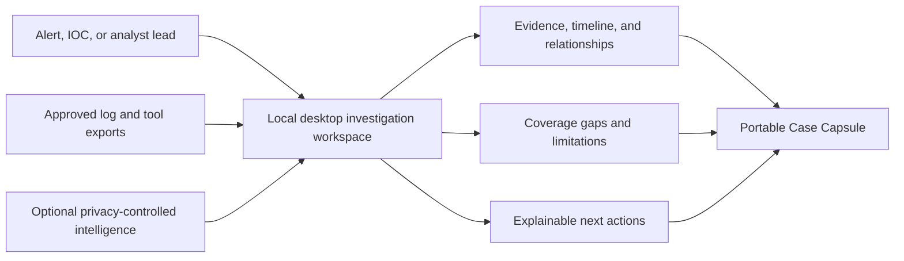
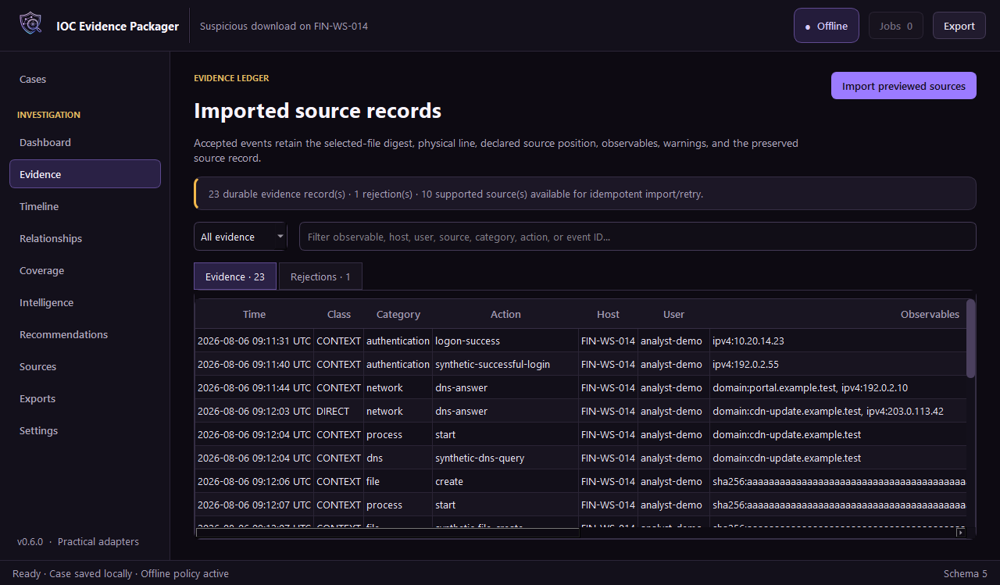
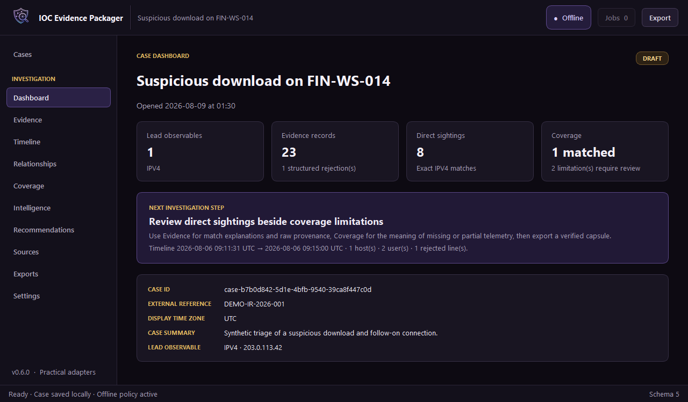
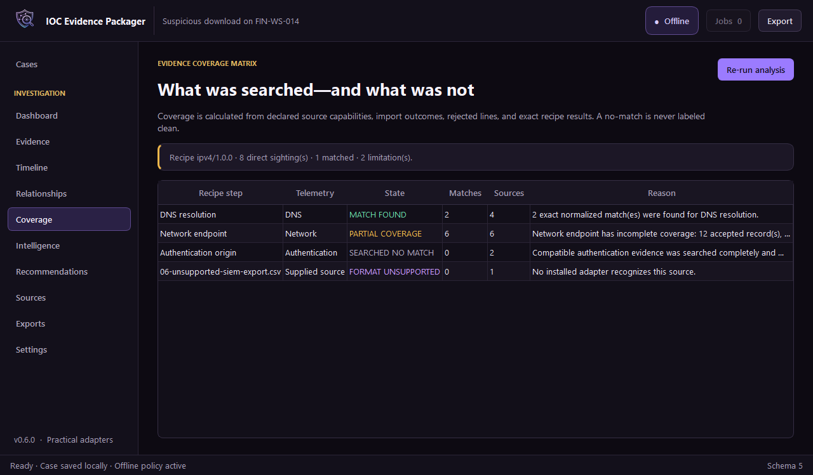
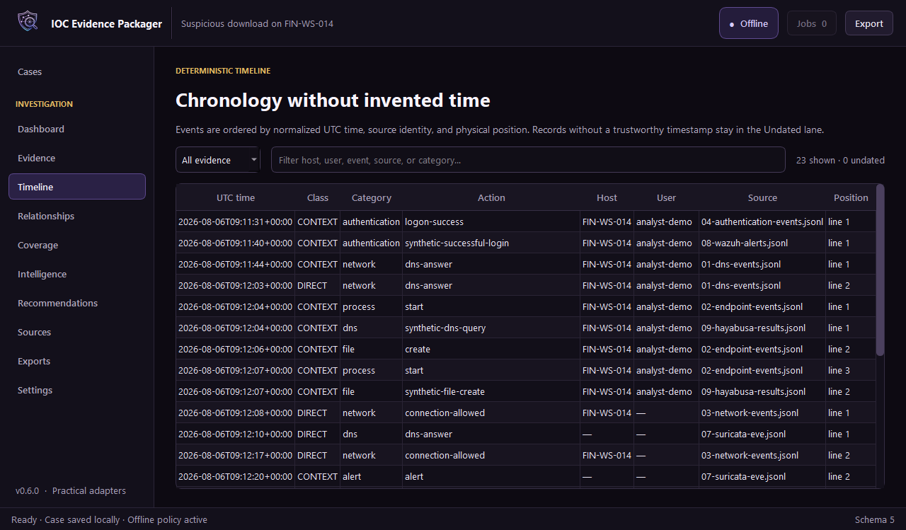
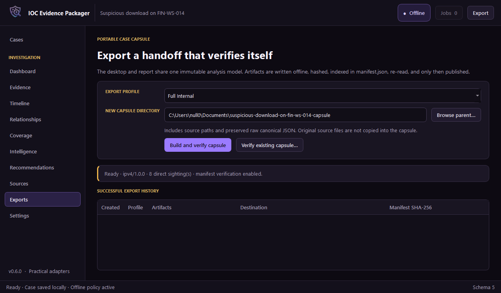
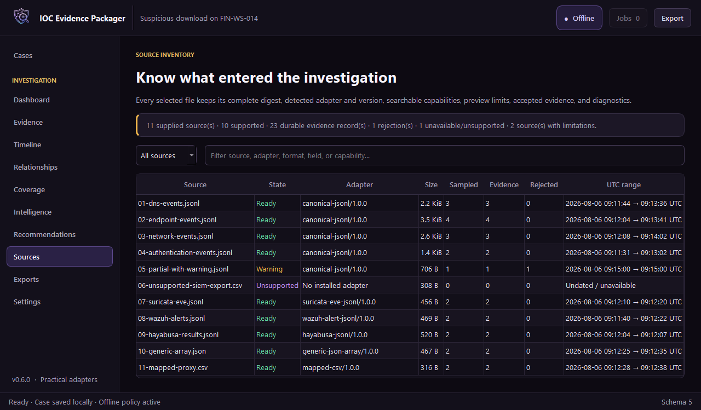
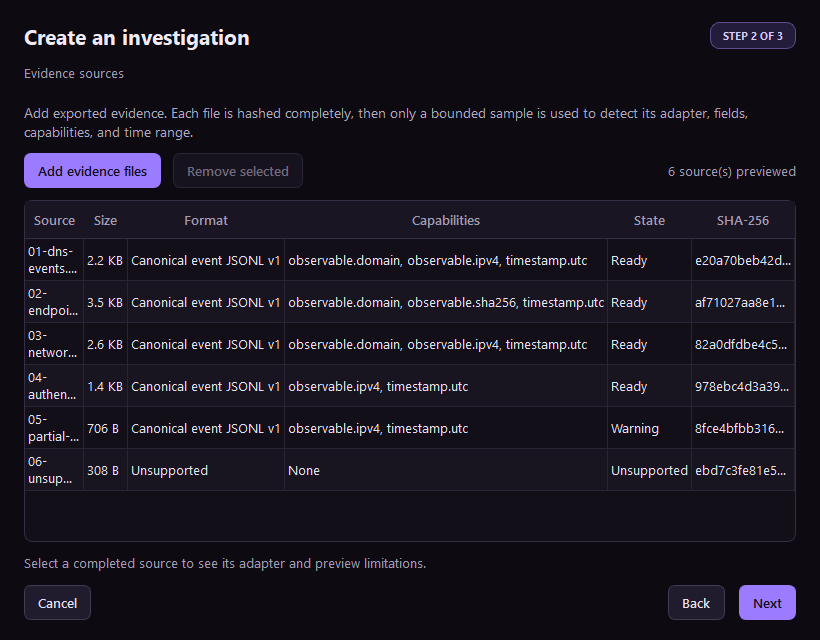

# IOC Evidence Packager


> Turn a suspicious observable and available telemetry into an explainable investigation workspace and a portable, verifiable handoff.

**Status:** v0.6.0 completes the five core slices plus the practical-adapter slice: heterogeneous source preview/import, exact IOC matching, coverage, timeline, source inventory, and verifiable Case Capsules.

IOC Evidence Packager is a local-first desktop application for SOC analysts, incident responders, and DFIR learners. An analyst opens a case, supplies one or more indicators and approved evidence exports, and progressively builds a source-linked timeline, relationship view, coverage assessment, optional intelligence, and an exportable **Case Capsule**.

The application does not merely answer "did this value occur?" It also answers:

- what was searched and which telemetry was actually available;
- where, when, and in which structured field the observable appeared;
- which hosts, users, processes, files, and destinations connect the observations;
- why every event or relationship is included;
- what could not be parsed, searched, or concluded;
- what the analyst should examine next, with reasons rather than a hidden score.

## Product concept



The GUI is the primary working surface. HTML, PDF, JSONL, CSV, STIX, and ZIP are export formats—not separate applications and not the source of truth.

## Why analysts would use it

Security evidence is normally scattered across SIEM searches, endpoint exports, DNS and proxy records, spreadsheets, and threat-intelligence tabs. Copying results into a ticket loses field mappings, source positions, search settings, rejected records, and the difference between an observed fact and an analyst inference.

This project fills the space between **searching telemetry** and **communicating a defensible investigation**:

1. guide the analyst through case creation and safe import;
2. normalize heterogeneous records without erasing their originals;
3. run IOC-specific search recipes against compatible fields;
4. expose direct sightings and carefully labeled context;
5. show an Evidence Coverage Matrix so "no match" is never confused with "not compromised";
6. enrich only under an explicit privacy policy;
7. produce a reproducible handoff for another analyst or system.

## The differentiator: coverage-aware evidence

For every source and search recipe, the application records one of these states:

| State | Meaning |
|---|---|
| `MATCH_FOUND` | A compatible field produced at least one explained match |
| `SEARCHED_NO_MATCH` | Compatible records were successfully searched, but no match was found |
| `PARTIAL_COVERAGE` | Only part of the source, time range, or compatible schema was searchable |
| `SOURCE_NOT_PROVIDED` | A useful telemetry category was not supplied |
| `SOURCE_FAILED` | The source was supplied but could not be processed reliably |
| `FORMAT_UNSUPPORTED` | The source format or schema has no compatible adapter |

This distinction is central to the product. A clean DNS export and a missing DNS export cannot support the same conclusion.

## Primary desktop workflow

1. Create a case and enter the lead observable, time range, and notes.
2. Add files or folders; preview detected formats, mappings, and warnings.
3. Select an offline or approved enrichment policy and review what may leave the machine.
4. Import evidence as a cancellable background job; matching and coverage update from the durable result.
5. Review the Dashboard, filterable Evidence ledger, deterministic Timeline, and Evidence Coverage Matrix.
6. Trace every direct sighting and coverage statement back to source bytes and physical lines.
7. Export and verify a Full Internal or Redacted Shareable Case Capsule.

Workspace areas are stable; later roadmap phases attach relationships, intelligence, and recommendations without restructuring the shell:

```text
Dashboard   Evidence   Timeline   Relationships   Coverage
Intelligence   Recommendations   Sources   Exports   Settings
```

See the [GUI and Interaction Design](docs/GUI_UX.md) for the screen-by-screen conception.

## Case Capsule

```text
case-001/
|-- report.html
|-- evidence.jsonl             # Facts, matches, explanations, provenance
|-- timeline.csv               # Deterministic, spreadsheet-safe chronology
|-- coverage.json              # States, reasons, recovery, supporting IDs
|-- source-inventory.json      # Digests, adapters, counts, warnings
`-- manifest.json              # Versions, policies, hashes, limitations
```

Different export profiles can omit or redact sensitive fields. The original local case remains unchanged. Read the full [Case Capsule Contract](docs/CASE_CAPSULE.md).

## Smart, explainable capabilities

- **Versioned IOC search recipes:** exact normalized matching for IPv4, domain, and SHA-256 values across declared compatible fields.
- **Evidence Coverage Matrix:** all six states show searched, missing, partial, failed, and unsupported telemetry with calculation reasons.
- **Filterable Evidence ledger:** every direct/context row carries source digest, record position, field path, rule, explanation, and preserved source record.
- **Deterministic Timeline:** UTC chronology with direct/context classification and an honest Undated lane.
- **Practical adapters:** canonical JSONL, Suricata eve.json, Wazuh alerts, Hayabusa JSONL, bounded generic JSON arrays, and explicitly mapped CSV all enter one provenance-preserving ledger.
- **Inspectable source inventory:** every supplied source exposes its digest, adapter/version, mapped capabilities, time range, evidence/rejection counts, and limitations.
- **Verifiable Case Capsules:** Full Internal and Redacted Shareable profiles, deterministic artifacts, manifest hashing, tamper detection, and export history.
- **Confidence without a magic score:** facts, intelligence assertions, correlations, and analyst assessments stay separate.
- **Reproducible runs:** case history records policies, versions, warnings, and artifacts.

Typed relationships, deterministic recommendations, and privacy-gated intelligence providers remain later roadmap phases; the current UI labels those areas honestly rather than simulating results.

The detailed behavior and guardrails are in [Core and Smart Features](docs/FEATURES.md).

## Technical foundation

| Area | Decision | Purpose |
|---|---|---|
| Desktop UI | PySide6 / Qt | Native cross-platform analyst workspace |
| Core | Headless Python application/domain services | Testable logic reusable by GUI and automation |
| Durable store | SQLite | Portable cases, provenance, notes, jobs, and cache metadata |
| Large-file scans | DuckDB, introduced only when justified | Efficient local CSV/JSON/Parquet exploration |
| Validation | Immutable dataclasses, explicit parsers, and versioned JSON envelopes | Stable boundaries and contracts |
| Reports | Jinja2 plus optional PDF engine | Safe human-readable exports |
| Automation | Thin optional CLI over the same services | Reproducible batch and CI use without a second implementation |
| Tests | pytest, golden cases, security fixtures | Determinism and evidence-handling assurance |

## Run the current desktop application

```powershell
python -m pip install -e ".[dev]"
python -m ioc_evidence_packager
```

The current application guides an analyst from case setup through durable evidence review:

- validates and canonicalizes IPv4, domain, and SHA-256 leads while preserving the original input;
- hashes every selected file locally with SHA-256;
- detects canonical JSONL, selected Suricata/Wazuh/Hayabusa schemas, bounded generic JSON arrays, and sidecar-mapped CSV using bounded previews;
- shows sampled fields, searchable capabilities, time bounds, and safe warnings before import;
- persists cases, imports, sightings, coverage, and export history in SQLite schema 5;
- verifies each source SHA-256 again immediately before import so changed evidence is rejected;
- streams JSONL/CSV adapters and bounded JSON-array mappings in background batches without freezing the desktop;
- exposes monotonic progress, cooperative cancellation, safe retry, and structured per-line rejections;
- keeps accepted evidence separate from rejected input and prevents duplicate durable records on retry;
- opens source path, digest, source position, declared provenance, observables, warnings, and the preserved source record in a non-modal Evidence detail window without shrinking the ledger;
- runs the matching recipe automatically, records structured explanations, and labels non-matches as context;
- evaluates all six coverage states from capabilities, results, warnings, rejections, and source diagnostics;
- presents deterministic UTC ordering in Timeline and case-level findings/limitations on Dashboard;
- builds capsules on a worker thread, writes the manifest last, verifies every artifact, publishes atomically, and records successful history;
- applies capsule-local host/user pseudonyms and omits raw source records/paths in Redacted Shareable exports;
- reopens the investigation with the same setup state and an explicit Offline policy.



### Finished core workspaces

| Dashboard | Evidence Coverage Matrix |
|---|---|
|  |  |
| Deterministic Timeline | Verified Case Capsule export |
|  |  |



For a short isolated verification that does not touch the normal case store:

```powershell
python -m ioc_evidence_packager --smoke-test
```

### Try the bundled evidence demo

Open **New investigation** and use these values:

- Case title: `Suspicious download on FIN-WS-014`
- Lead observable: `203.0.113.42`
- Evidence: select the numbered evidence files in [`samples/input/demo-investigation`](samples/input/demo-investigation/README.md); do not select the `.ioc-map.json` sidecar separately

Create the investigation, open **Evidence**, and select **Import previewed sources**. The original four canonical files produce 12 durable records and no rejection. Selecting all eleven evidence files produces 23 durable records plus one `invalid_json` rejection across six adapter families; `06-unsupported-siem-export.csv` remains visible but ineligible because it has no mapping sidecar. Retrying is idempotent, so durable totals stay unchanged.

With all eleven evidence files selected, the IPv4 recipe produces eight exact sightings across canonical, Suricata, Wazuh, generic JSON, and mapped CSV records. Coverage still shows DNS `MATCH_FOUND`, network `PARTIAL_COVERAGE`, authentication `SEARCHED_NO_MATCH`, and the unmapped CSV as `FORMAT_UNSUPPORTED`. Open **Sources** to audit every adapter and limitation, then **Exports** to create a capsule that is published only after every artifact passes manifest verification.

The included guide explains the synthetic incident, expected Ready/Warning/Unsupported states, alternate domain and SHA-256 leads, and the exact evidence/rejection totals. All addresses and domains are private or documentation-only; do not replace them with personal or production infrastructure in a public repository.



The GUI never owns matching, storage, enrichment, or export logic. It calls application services, receives immutable view models, and observes background jobs. See [Architecture](docs/ARCHITECTURE.md) and the [Implementation Blueprint](docs/IMPLEMENTATION_BLUEPRINT.md).

Reference-fixture measurements and the current decision to retain streaming plus SQLite are documented in [Performance notes](docs/PERFORMANCE.md).

## Input and integration direction

Implemented local adapters cover canonical JSONL, bounded generic JSON arrays, explicit CSV mapping profiles, selected Wazuh alerts JSONL, Suricata `eve.json`, and Hayabusa JSONL. Planned formats include Zeek, Plaso exports, Velociraptor results, Elastic Common Schema, Parquet, and OCSF.

Optional providers and handoffs include CIRCL hashlookup, ThreatFox, URLhaus, MalwareBazaar, GreyNoise Community, RDAP, MITRE ATT&CK, MISP, OpenCTI, TheHive, Timesketch, Wazuh/OpenSearch, and Velociraptor. Each remains isolated behind a capability contract and explicit policy. See [Integrations and Enrichment](docs/INTEGRATIONS.md).

## Boundaries

The project is not a SIEM, EDR, collector, malware sandbox, threat-intelligence platform, or autonomous response system. The core will not:

- run commands on endpoints or continuously ingest telemetry;
- upload evidence or files automatically;
- decide that an IOC, host, or user is malicious;
- combine unrelated providers into an unexplained "maliciousness" score;
- let a language model select, remove, or alter evidence;
- claim that an export is automatically court-admissible.

Active collection and remediation belong in specialist tools and require a separately authorized integration.

## Repository map

```text
docs/                         Product and implementation specification
samples/input/                Safe synthetic source exports
samples/expected/             Checked redacted Case Capsule and golden outputs
src/ioc_evidence_packager/    Implemented domain, services, adapters, storage, reporting, and GUI
tests/unit/                   Domain and adapter behavior
tests/integration/            End-to-end case workflows
tests/ui/                     Focused offscreen desktop behavior
tests/security/               Hostile-input and trust-boundary fixtures
```

## Documentation

- [Project Primer](docs/PROJECT_PRIMER.md) — plain-language explanation and example
- [Product Vision](docs/PRODUCT_VISION.md) — users, value, principles, and success measures
- [Problem Study](docs/PROBLEM_STUDY.md) — analyst pain and existing-solution positioning
- [Scope](docs/SCOPE.md) — first-release contract, acceptance criteria, and non-goals
- [Core and Smart Features](docs/FEATURES.md) — capabilities, reasoning rules, and feature tiers
- [GUI and Interaction Design](docs/GUI_UX.md) — screens, flows, states, and usability rules
- [Architecture](docs/ARCHITECTURE.md) — layers, data flow, storage, trust boundaries
- [Case Capsule Contract](docs/CASE_CAPSULE.md) — export structure, integrity, and redaction
- [Integrations and Enrichment](docs/INTEGRATIONS.md) — adapters, providers, privacy, and APIs
- [Implementation Blueprint](docs/IMPLEMENTATION_BLUEPRINT.md) — modules, slices, tests, and decisions
- [Roadmap](docs/ROADMAP.md) — delivery phases and exit conditions
- [Glossary](docs/GLOSSARY.md) — shared SOC/DFIR and product vocabulary
- [References](docs/REFERENCES.md) — official standards and tool documentation

## Next implementation milestone

The five core slices and Phase 5 practical adapters are complete. The next roadmap milestone is **Phase 6: Relationships and next actions**—bounded typed relationships, evidence-preserving pivots, and deterministic recommendations that cite the exact evidence and coverage conditions that triggered them. See the [Roadmap](docs/ROADMAP.md).

## License

No license has been selected yet. Until one is added, normal copyright rules apply.
