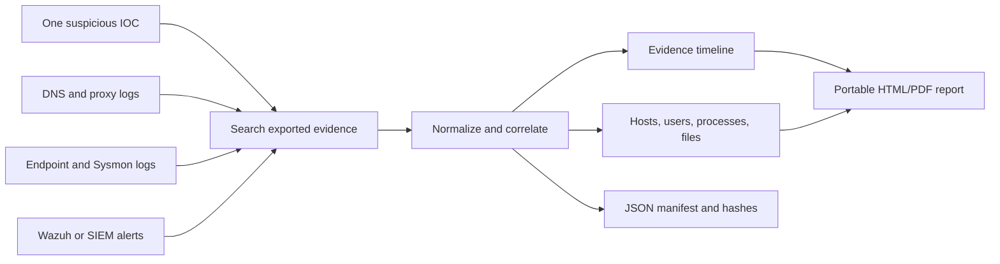

# IOC Evidence Packager

> Turn one suspicious indicator into a portable, reviewable evidence bundle.

**Status:** documentation-first scaffold; the application is not implemented yet.

IOC Evidence Packager is a planned local-first Python tool for SOC analysts, incident responders, and DFIR learners.

## The idea

One IOC plus exported logs becomes a source-linked timeline, an HTML/PDF report, and a JSON manifest.



Analysts commonly copy results between consoles, spreadsheets, tickets, and screenshots. That is slow, inconsistent, and difficult to reproduce. This project makes the packaging step repeatable without requiring an enterprise platform.

## Where it would be used

- **Small SOCs:** package evidence behind an alert before escalation.
- **Incident response:** hand a concise IOC-centered timeline to a case owner.
- **DFIR labs:** practice correlation using safe synthetic data.
- **Consulting/MSSPs:** standardize a portable client handoff from approved exports.
- **Privacy-sensitive environments:** process locally without sending telemetry outside by default.

## Planned workflow

1. Import supported exported logs.
2. Validate and normalize the IOC and event fields.
3. Store canonical events and provenance in SQLite.
4. Find direct matches and selected contextual events.
5. Explain why every result was included.
6. Render HTML and JSON; optionally render PDF.
7. Record inputs, parameters, versions, rejected records, and SHA-256 hashes.

Proposed interface (not available yet):

```text
ioc-packager package --ioc 203.0.113.42 --input ./samples/input/ --output ./output/case-001/
```

## Planned evidence bundle

```text
case-001/
|-- report.html
|-- report.pdf             # Optional
|-- evidence.json
|-- manifest.json
`-- source-inventory.json
```

A report should answer what was searched, which sources were examined, where and when the IOC appeared, which entities were involved, why each event matched, what could not be processed, and how another analyst can reproduce the result.

## Boundaries

The project packages evidence; it does not acquire evidence from live systems. It will not replace a SIEM, EDR, threat-intelligence platform, malware sandbox, or forensic case system. It will not declare an IOC malicious merely because it appears in a log, and it will not claim that generated reports are automatically court-admissible.

Existing tools solve adjacent, broader problems: MISP/OpenCTI manage intelligence, VirusTotal Graph/IntelOwl enrich observables, Timesketch analyzes forensic timelines, Velociraptor collects endpoint artifacts, and SIEMs search operational telemetry. This project consumes existing exports and creates one defensible handoff. See the [Problem Study](docs/PROBLEM_STUDY.md).

## Planned foundation

| Area | Choice | Reason |
|---|---|---|
| Language | Python 3.11+ | Parsing ecosystem and analyst accessibility |
| Storage | SQLite | Portable and serverless |
| Templates | Jinja2 | Separates presentation from evidence logic |
| Interface | CLI first | Scriptable and testable |
| Output | HTML, JSON, optional PDF | Human review plus integration |
| Tests | pytest | Unit, fixture, and end-to-end tests |

## Repository map

```text
docs/                         Product study, scope, architecture, roadmap
samples/input/                Safe synthetic exports
samples/expected/             Golden expected packages
src/ioc_evidence_packager/
  ingestion/                  Adapters and normalization
  matching/                   IOC validation, search, correlation
  reporting/                  HTML/PDF/JSON output
  storage/                    SQLite persistence and queries
tests/unit/                   Focused behavior tests
tests/integration/            End-to-end package tests
```

## Documentation

- [Project Primer](docs/PROJECT_PRIMER.md) - plain-language explanation and scenario
- [Problem Study](docs/PROBLEM_STUDY.md) - existing solutions and relative gaps
- [Scope](docs/SCOPE.md) - v1 contract and non-goals
- [Architecture](docs/ARCHITECTURE.md) - components, flow, trust boundaries, evidence model
- [Roadmap](docs/ROADMAP.md) - staged implementation plan
- [Glossary](docs/GLOSSARY.md) - key SOC/DFIR terms
- [References](docs/REFERENCES.md) - official sources

## Evidence-handling principles

Treat logs as untrusted, escape report content, prevent path traversal, preserve raw values, hash inputs/outputs, explain every match, keep processing local by default, and never use sensitive production evidence as public test data. Read [SECURITY.md](SECURITY.md) before using real organizational data.

## Next milestone

Build a thin vertical slice: import synthetic JSONL, search one normalized IPv4/domain/SHA-256 IOC, preserve provenance, and render deterministic HTML plus JSON.

## License

No license has been selected yet. Until one is added, normal copyright rules apply.
