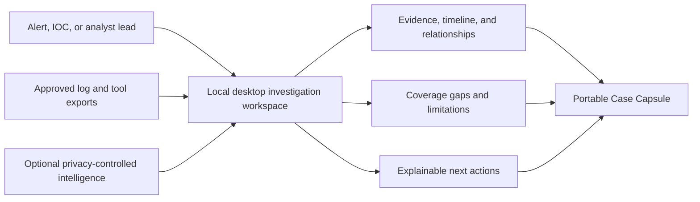

# IOC Evidence Packager

> Turn a suspicious observable and available telemetry into an explainable investigation workspace and a portable, verifiable handoff.

**Status:** product design complete; implementation has not started.

IOC Evidence Packager is a planned local-first desktop application for SOC analysts, incident responders, and DFIR learners. An analyst opens a case, supplies one or more indicators and approved evidence exports, and receives a source-linked timeline, relationship view, coverage assessment, optional intelligence, and an exportable **Case Capsule**.

The application does not merely answer "did this value occur?" It also answers:

- what was searched and which telemetry was actually available;
- where, when, and in which structured field the observable appeared;
- which hosts, users, processes, files, and destinations connect the observations;
- why every event or relationship is included;
- what could not be parsed, searched, or concluded;
- what the analyst should examine next, with reasons rather than a hidden score.

## Product concept



The GUI is the primary working surface. HTML, PDF, JSONL, CSV, STIX, and ZIP are export formats—not separate applications and not the source of truth.

## Why analysts would use it

Security evidence is normally scattered across SIEM searches, endpoint exports, DNS and proxy records, spreadsheets, and threat-intelligence tabs. Copying results into a ticket loses field mappings, source positions, search settings, rejected records, and the difference between an observed fact and an analyst inference.

This project fills the space between **searching telemetry** and **communicating a defensible investigation**:

1. guide the analyst through case creation and safe import;
2. normalize heterogeneous records without erasing their originals;
3. run IOC-specific search recipes against compatible fields;
4. expose direct sightings and carefully labeled context;
5. show an Evidence Coverage Matrix so "no match" is never confused with "not compromised";
6. enrich only under an explicit privacy policy;
7. produce a reproducible handoff for another analyst or system.

## The differentiator: coverage-aware evidence

For every source and search recipe, the application records one of these states:

| State | Meaning |
|---|---|
| `MATCH_FOUND` | A compatible field produced at least one explained match |
| `SEARCHED_NO_MATCH` | Compatible records were successfully searched, but no match was found |
| `PARTIAL_COVERAGE` | Only part of the source, time range, or compatible schema was searchable |
| `SOURCE_NOT_PROVIDED` | A useful telemetry category was not supplied |
| `SOURCE_FAILED` | The source was supplied but could not be processed reliably |
| `FORMAT_UNSUPPORTED` | The source format or schema has no compatible adapter |

This distinction is central to the product. A clean DNS export and a missing DNS export cannot support the same conclusion.

## Primary desktop workflow

1. Create a case and enter the lead observable, time range, and notes.
2. Add files or folders; preview detected formats, mappings, and warnings.
3. Select an offline or approved enrichment policy and review what may leave the machine.
4. Run the investigation as a cancellable background job.
5. Review the dashboard, evidence table, timeline, relationships, coverage, and intelligence.
6. Accept, reject, annotate, or bookmark evidence without changing the preserved source facts.
7. Export a full, redacted, executive, or machine-readable Case Capsule.

Planned workspace areas:

```text
Dashboard   Evidence   Timeline   Relationships   Coverage
Intelligence   Recommendations   Sources   Exports   Settings
```

See the [GUI and Interaction Design](docs/GUI_UX.md) for the screen-by-screen conception.

## Case Capsule

```text
case-001/
|-- report.html
|-- report.pdf                 # Optional shareable rendering
|-- evidence.jsonl             # Normalized, source-linked observations
|-- timeline.csv
|-- graph.json
|-- coverage.json
|-- source-inventory.json
|-- enrichment/
|   `-- provider-results.json
`-- manifest.json              # Versions, parameters, hashes, warnings
```

Different export profiles can omit or redact sensitive fields. The original local case remains unchanged. Read the full [Case Capsule Contract](docs/CASE_CAPSULE.md).

## Smart, explainable capabilities

- **IOC search recipes:** different fields and pivots for IPs, domains, URLs, and hashes.
- **Evidence Coverage Matrix:** shows searched, missing, partial, failed, and unsupported telemetry.
- **Evidence ledger:** every row carries source hash, record position, adapter, field path, rule, and explanation.
- **Relationship graph:** connects observables, hosts, users, processes, files, and events without converting correlation into causation.
- **Next-action engine:** rule-based suggestions cite evidence IDs and coverage gaps.
- **Confidence without a magic score:** facts, intelligence assertions, correlations, and analyst assessments stay separate.
- **Privacy firewall:** enrichment profiles reveal exactly which observable is sent to which provider.
- **Reproducible runs:** case history records policies, versions, warnings, and artifacts.

The detailed behavior and guardrails are in [Core and Smart Features](docs/FEATURES.md).

## Planned technical foundation

| Area | Decision | Purpose |
|---|---|---|
| Desktop UI | PySide6 / Qt | Native cross-platform analyst workspace |
| Core | Headless Python application/domain services | Testable logic reusable by GUI and automation |
| Durable store | SQLite | Portable cases, provenance, notes, jobs, and cache metadata |
| Large-file scans | DuckDB, introduced only when justified | Efficient local CSV/JSON/Parquet exploration |
| Validation | Pydantic models and explicit schemas | Stable boundaries and versioned contracts |
| Reports | Jinja2 plus optional PDF engine | Safe human-readable exports |
| Automation | Thin optional CLI over the same services | Reproducible batch and CI use without a second implementation |
| Tests | pytest, golden cases, security fixtures | Determinism and evidence-handling assurance |

The GUI never owns matching, storage, enrichment, or export logic. It calls application services, receives immutable view models, and observes background jobs. See [Architecture](docs/ARCHITECTURE.md) and the [Implementation Blueprint](docs/IMPLEMENTATION_BLUEPRINT.md).

## Input and integration direction

The first slice uses canonical JSONL and a safe synthetic incident. Planned adapters then include generic JSON/CSV/Parquet, Wazuh, Suricata `eve.json`, Zeek, Sysmon via Hayabusa JSONL, Plaso exports, Velociraptor results, and Elastic Common Schema.

Optional providers and handoffs include CIRCL hashlookup, ThreatFox, URLhaus, MalwareBazaar, GreyNoise Community, RDAP, MITRE ATT&CK, MISP, OpenCTI, TheHive, Timesketch, Wazuh/OpenSearch, and Velociraptor. Each remains isolated behind a capability contract and explicit policy. See [Integrations and Enrichment](docs/INTEGRATIONS.md).

## Boundaries

The project is not a SIEM, EDR, collector, malware sandbox, threat-intelligence platform, or autonomous response system. The core will not:

- run commands on endpoints or continuously ingest telemetry;
- upload evidence or files automatically;
- decide that an IOC, host, or user is malicious;
- combine unrelated providers into an unexplained "maliciousness" score;
- let a language model select, remove, or alter evidence;
- claim that an export is automatically court-admissible.

Active collection and remediation belong in specialist tools and require a separately authorized integration.

## Repository map

```text
docs/                         Product and implementation specification
samples/input/                Safe synthetic source exports
samples/expected/             Golden Case Capsule outputs
src/ioc_evidence_packager/    Future application packages
tests/unit/                   Domain and adapter behavior
tests/integration/            End-to-end case workflows
tests/ui/                     Focused offscreen desktop behavior
tests/security/               Hostile-input and trust-boundary fixtures
```

## Documentation

- [Project Primer](docs/PROJECT_PRIMER.md) — plain-language explanation and example
- [Product Vision](docs/PRODUCT_VISION.md) — users, value, principles, and success measures
- [Problem Study](docs/PROBLEM_STUDY.md) — analyst pain and existing-solution positioning
- [Scope](docs/SCOPE.md) — first-release contract, acceptance criteria, and non-goals
- [Core and Smart Features](docs/FEATURES.md) — capabilities, reasoning rules, and feature tiers
- [GUI and Interaction Design](docs/GUI_UX.md) — screens, flows, states, and usability rules
- [Architecture](docs/ARCHITECTURE.md) — layers, data flow, storage, trust boundaries
- [Case Capsule Contract](docs/CASE_CAPSULE.md) — export structure, integrity, and redaction
- [Integrations and Enrichment](docs/INTEGRATIONS.md) — adapters, providers, privacy, and APIs
- [Implementation Blueprint](docs/IMPLEMENTATION_BLUEPRINT.md) — modules, slices, tests, and decisions
- [Roadmap](docs/ROADMAP.md) — delivery phases and exit conditions
- [Glossary](docs/GLOSSARY.md) — shared SOC/DFIR and product vocabulary
- [References](docs/REFERENCES.md) — official standards and tool documentation

## Next implementation milestone

Build a narrow but visible desktop slice: application shell, case creation, SQLite case store, canonical JSONL import preview, IPv4/domain/SHA-256 validation, cancellable import job, evidence table with provenance, coverage state, and deterministic JSONL/HTML export from the same report model.

## License

No license has been selected yet. Until one is added, normal copyright rules apply.
