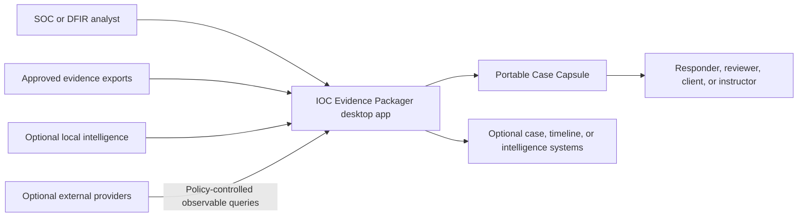
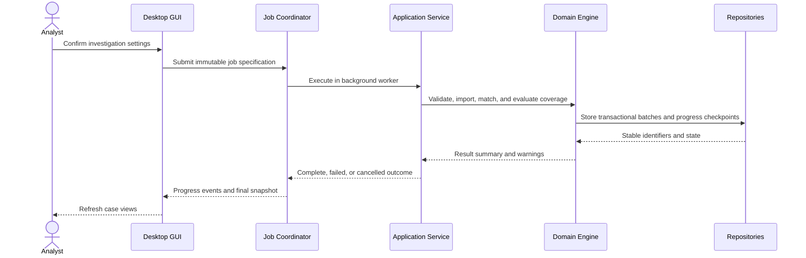
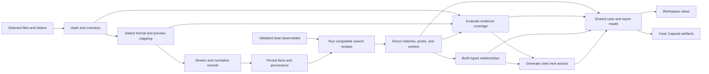
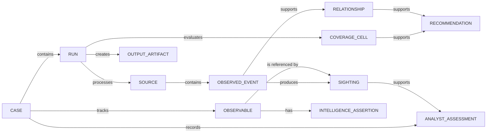

# Architecture

## Architectural intent

The application is a desktop investigation workspace over a headless evidence engine. Qt provides presentation and interaction; it does not contain evidence rules. The same application services can later serve a thin CLI, tests, or approved connectors without reproducing business logic.

The architecture favors local execution, explicit provenance, versioned contracts, background work, deterministic evidence, and a strict separation between observed facts, correlations, intelligence assertions, analyst assessments, and rendered output.

## System context



Upstream collection, provider claims, analyst decisions, and downstream system behavior are explicit trust boundaries.

## Layered design

```mermaid
flowchart TB
    subgraph Presentation["Presentation layer"]
        GUI["PySide6 desktop GUI"]
        CLI["Optional thin CLI"]
    end

    subgraph Application["Application layer"]
        Cases["Case service"]
        Imports["Import service"]
        Investigations["Investigation service"]
        Jobs["Job coordinator"]
        ExportsService["Export service"]
    end

    subgraph Domain["Domain layer"]
        Values["Observable and evidence value objects"]
        Recipes["Search recipes"]
        Matching["Matching and correlation rules"]
        Coverage["Coverage evaluator"]
        Recommender["Recommendation rules"]
        ReportModel["Shared case and report model"]
    end

    subgraph Ports["Ports and infrastructure"]
        Adapters["Evidence adapters"]
        SQLite[("SQLite case store")]
        DuckDB["Optional DuckDB scan engine"]
        Enrichment["Enrichment connectors and cache"]
        Handoffs["Platform handoff connectors"]
        Renderers["HTML, PDF, JSONL, CSV renderers"]
    end

    GUI --> Cases
    GUI --> Imports
    GUI --> Investigations
    GUI --> Jobs
    GUI --> ExportsService
    CLI --> Cases
    CLI --> Imports
    CLI --> Investigations
    CLI --> ExportsService
    Cases --> Values
    Imports --> Recipes
    Investigations --> Matching
    Investigations --> Coverage
    Investigations --> Recommender
    ExportsService --> ReportModel
    Imports --> Adapters
    Cases --> SQLite
    Investigations --> SQLite
    Imports --> DuckDB
    Investigations --> Enrichment
    ExportsService --> Handoffs
    ExportsService --> Renderers
```



Dependencies point inward. Domain code has no imports from Qt, SQL drivers, HTTP clients, template engines, or vendor SDKs.

## Package responsibilities

| Package | Owns | Must not own |
|---|---|---|
| `domain` | value objects, states, evidence semantics, rule interfaces | Qt widgets, SQL, files, HTTP |
| `application` | use cases, commands, transactions, job specifications, ports | widget state or vendor parsing |
| `presentation` | windows, view models, user input, navigation, progress | evidence matching or SQL queries |
| `ingestion` | adapter discovery, parsing, mapping, normalization, diagnostics | maliciousness or report presentation |
| `matching` | recipe execution, direct matches, pivots, bounded context | provider calls or raw-record mutation |
| `coverage` | source/recipe/time/host coverage calculation | vague confidence scoring |
| `recommendations` | deterministic next-action rules and citations | executing collection or remediation |
| `storage` | schemas, migrations, repositories, unit-of-work | vendor-specific mapping |
| `intelligence` | provider ports, normalized assertions, caching, policy checks | merging provider verdicts into facts |
| `reporting` | immutable view model and artifact renderers | reinterpreting evidence |
| `integrations` | read-only searches and outbound handoff adapters | domain policy or credentials in code |

## Desktop interaction model

The GUI submits commands and observes immutable snapshots or events. Long work never blocks the Qt event loop.



### Background-job rules

- Jobs have queued, running, cancelling, cancelled, succeeded, partially succeeded, and failed states.
- Progress contains stage, current source, accepted/rejected counts, bytes or records processed, warnings, and an indeterminate option.
- Cancellation is cooperative and checked between bounded batches and network requests.
- Results become visible only after a transaction or named checkpoint commits.
- A cancelled or failed run never appears complete; accepted source batches remain auditable and may be resumed when safe.
- Qt signals carry identifiers and display-safe summaries, not mutable database/domain objects.

## Investigation data flow



## Domain concepts

### Separate semantic layers

| Concept | Meaning | Example |
|---|---|---|
| Observable | A value that can be normalized and searched | `203.0.113.42` |
| Observed event | A fact derived from a supplied source record | Proxy record containing the IP |
| Sighting | The linkage between an observable and an observed event | IP appeared as `destination.ip` |
| Correlation | A declared rule connecting facts/entities | Same host and process within 30 seconds |
| Intelligence assertion | A provider's claim about an observable | Provider labels hash as a malware family |
| Analyst assessment | A human conclusion with rationale | "Likely execution on WS-014" |
| Recommendation | A rule-produced proposed next step | Search parent-process telemetry |

This separation is compatible with the intent of STIX 2.1's distinction between cyber-observable data, Observed Data, Indicators, and Sightings, without requiring the internal store to be a STIX database.

### Entity relationships



## Evidence identity and provenance

- A source ID identifies exact supplied bytes and includes a SHA-256 digest.
- An event ID is stable for a source digest, adapter major version, and source position.
- A sighting identifies the event, observable, field path, normalization rule, and match recipe.
- A relationship identifies its typed rule and supporting event/sighting IDs.
- An analyst annotation has its own author/time history and never rewrites the fact.
- Content identities are distinct from database row identifiers.

Changing an adapter's interpretation may produce a new normalized event version while retaining the same source reference.

## Coverage model

Coverage is evaluated for a tuple such as:

```text
(run, recipe_step, telemetry_category, entity_scope, requested_interval)
```

The evaluator considers adapter capabilities, supplied sources, source time bounds, entity bounds, accepted/rejected records, fields present, parse failures, and completed recipe steps. It emits exactly one state plus structured reasons and supporting source/job IDs.

The six normative states are `MATCH_FOUND`, `SEARCHED_NO_MATCH`, `PARTIAL_COVERAGE`, `SOURCE_NOT_PROVIDED`, `SOURCE_FAILED`, and `FORMAT_UNSUPPORTED`.

## Storage strategy

### SQLite: durable case system of record

SQLite stores:

- cases, observables, sources, jobs, runs, and policies;
- normalized events, sightings, relationships, and coverage cells;
- provider assertions and cache metadata;
- annotations, assessments, recommendation state, and export history;
- schema and adapter versions.

Use WAL mode only after testing its interaction with backups and removable/network locations. Apply migrations transactionally and make backups before incompatible migration steps.

### DuckDB: optional scan accelerator

DuckDB is not the case system of record. Introduce it only when measured fixtures show SQLite plus streaming is insufficient for large CSV, JSON, or Parquet exploration. Results entering the case still pass through domain validation and receive durable provenance.

### Source bytes

Cases can reference original files in place or copy approved evidence into a managed case area. The choice is explicit. Missing referenced files do not erase imported facts; they reduce future raw-record availability and appear as a case warning.

## Enrichment and network boundary

Every connector declares capabilities, accepted observable types, disclosure class, authentication method, rate-limit behavior, cache TTL, and license/usage notes.

The application service checks the case policy before the connector receives a request. The connector receives the minimum observable value—not a case, event, hostname, username, or file—unless a separately defined enterprise connector explicitly requires and declares more.

Store retrieval time, provider, endpoint/capability, query value or protected query digest, normalized assertion, raw-response hash, cache status, expiry, and errors. Secrets remain outside the case database and exports.

## Shared report model

GUI panels and exporters consume the same immutable, versioned projection. Exporters may apply formatting or an explicit redaction projection, but may not perform new matching, coverage evaluation, correlation, or intelligence interpretation.

This prevents a common failure: an HTML report and the desktop view disagreeing because each implements its own business rules.

## Determinism and integrity

- Preserve original timestamp text and record normalization assumptions.
- Sort evidence by normalized time, source identity, and source position.
- Serialize JSON with a documented encoding, stable keys, and schema versions.
- Record application, recipe, adapter, policy, schema, and renderer versions.
- Hash sources before processing and finalized output artifacts after writing.
- Keep volatile UI preferences and generation time out of golden evidence comparisons.
- Write a manifest last, after every included artifact is finalized.

A digest detects byte changes. It does not prove who acquired the source or establish legal chain of custody.

## Security boundaries

### Untrusted evidence

Adapters enforce byte, record, field, nesting, and decompression limits. They use predictable decoding, structured errors, and no dynamic execution. Formula-like CSV text, HTML, URLs, paths, and terminal sequences remain untrusted data.

### Filesystem

Resolve and validate source, case, cache, temporary, and export paths. Generated names use application identifiers. Refuse source overwrite, traversal, unsafe archive extraction, and symlink/reparse-point escapes where relevant.

### Rendering

Jinja2 auto-escaping is mandatory. PDF conversion cannot fetch remote resources or read arbitrary local files. GUI rich-text widgets display evidence as escaped plain text unless an allow-listed renderer is required.

### Database

Use parameterized SQL, controlled migrations, bounded queries, transactions, and tested backup/recovery. Raw evidence is data, never SQL, HTML, or code.

### Provider and secret handling

No network action occurs in offline mode. API keys use an operating-system credential store or environment/config indirection, never source control, case exports, logs, or exception messages.

## Failure semantics

Transparent partial success is the default for recoverable record errors. A malformed record increases rejection counts and coverage limitations without discarding valid records. A whole source fails when its format, integrity, or interpretation cannot be trusted.

Fatal conditions include an invalid lead, unsafe case/output path, database transaction failure that prevents a consistent checkpoint, or inability to finalize the manifest. The UI shows remediation and preserves logs without leaking raw evidence.

## Planned source layout

```text
src/ioc_evidence_packager/
|-- domain/
|   |-- observables.py
|   |-- evidence.py
|   |-- coverage.py
|   `-- recommendations.py
|-- application/
|   |-- commands.py
|   |-- services.py
|   |-- jobs.py
|   `-- ports.py
|-- presentation/
|   `-- desktop/
|       |-- app.py
|       |-- windows/
|       |-- views/
|       `-- viewmodels/
|-- ingestion/
|   |-- registry.py
|   |-- canonical_jsonl.py
|   `-- mappings/
|-- matching/
|   |-- recipes/
|   `-- engine.py
|-- storage/
|   |-- sqlite/
|   `-- migrations/
|-- intelligence/
|   |-- policy.py
|   |-- cache.py
|   `-- providers/
|-- reporting/
|   |-- model.py
|   `-- renderers/
`-- integrations/
```

## Decisions intentionally deferred

The PDF engine, installer technology, code-signing process, DuckDB threshold, graph widget, secrets backend abstraction, connector plug-in distribution, native EVTX feasibility, and signed-manifest format require prototypes or deployment evidence. Their interfaces may be reserved, but they should not delay the first end-to-end desktop slice.
