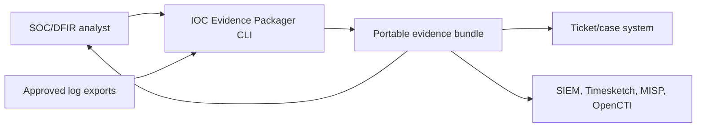
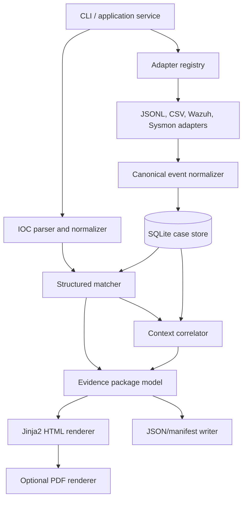
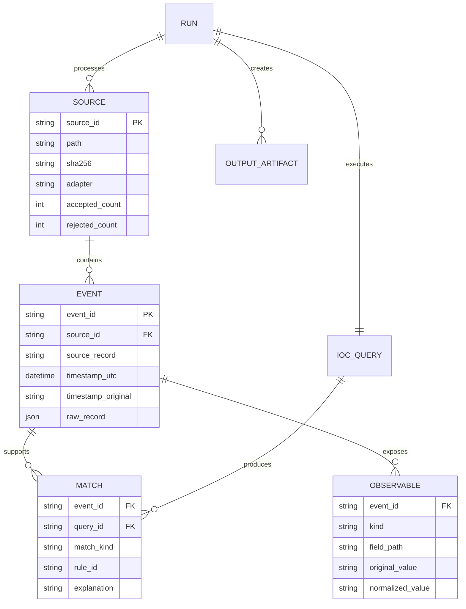

# Architecture

## Design goals

The architecture favors local execution, explicit provenance, small replaceable adapters, deterministic output, and a strict separation between facts, correlations, and presentation.

## Context



The application does not control upstream collection or downstream case decisions. Those are trust boundaries, not hidden responsibilities.

## Components



### Package boundaries

| Package | Responsibility | Must not do |
|---|---|---|
| `ingestion` | identify/read formats, map fields, report parsing errors | decide maliciousness or render reports |
| `matching` | validate IOCs, direct-match fields, attach explanations, add configured context | mutate raw records or call external services |
| `storage` | schema, transactions, indexed queries, migrations | contain vendor-specific parsing |
| `reporting` | assemble view models and render safe outputs | reinterpret evidence or hide warnings |
| application/CLI | coordinate use cases and user-facing errors | embed parser or template details |

## End-to-end data flow

```mermaid
sequenceDiagram
    actor A as Analyst
    participant C as CLI
    participant I as Ingestion
    participant S as SQLite
    participant M as Matcher
    participant R as Reporter

    A->>C: package IOC + input paths + output path
    C->>C: validate settings and normalize IOC
    loop Each input
        C->>I: stream records through selected adapter
        I->>I: preserve raw value; normalize canonical fields
        I->>S: store source, event, warnings, and source position
    end
    C->>M: search canonical IOC in compatible fields
    M->>S: parameterized match/context queries
    S-->>M: direct matches and requested context
    M-->>C: evidence set with explanations
    C->>R: immutable report model
    R-->>C: HTML, evidence JSON, inventory, manifest
    C-->>A: bundle path and summary counts
```

## Canonical evidence model

The schema will evolve through migrations, but its concepts should remain stable:



The source hash covers bytes supplied to the tool. An event ID identifies a record within that source; it must not pretend to be a universal forensic identifier.

## Direct match vs. context

- A **direct match** means a declared compatible field normalizes to the queried IOC.
- A **context event** does not contain the IOC but is included by an explicit rule such as same host/process within a configured time window.
- A **raw-text fallback** is neither of the above and, if supported, is labeled as lower-confidence because substring searches can match unrelated text.

The report must never merge these categories into a single unexplained score.

## Trust boundaries and controls

### Untrusted input boundary

Logs can contain malicious HTML, spreadsheet formulas, enormous fields, malformed encodings, crafted paths, or deeply nested JSON. Adapters need size/depth limits, predictable decoding, structured errors, and no dynamic code execution.

### Storage boundary

Use parameterized SQL, controlled migrations, transactions, and application-generated identifiers. Raw evidence remains data, never SQL or template code.

### Report boundary

Jinja2 auto-escaping is mandatory for HTML. URLs, filenames, anchors, and CSS classes derived from evidence require allow-list validation. PDF conversion must not fetch remote resources or read arbitrary local files.

### Filesystem boundary

Resolve and validate input/output paths. Generated names come from safe application identifiers, not raw IOC text. Refuse to overwrite input evidence and prevent traversal outside the selected output directory.

### Network boundary

Core packaging performs no network calls. Any later enrichment plugin is opt-in, separately labeled, given only the minimum observable, and recorded in the manifest with provider and time.

## Determinism and integrity

- Normalize timestamps to UTC while preserving original text and assumptions.
- Sort evidence by normalized time, then source ID and record position.
- Serialize JSON with stable key order and documented encoding.
- Separate volatile generation time from evidence content used in golden tests.
- Hash input files before processing and finalized outputs after writing.
- Record application, schema, adapter, template, and matching-policy versions.

A SHA-256 manifest detects later modification; it does not prove who acquired the source or establish legal chain of custody.

## Failure behavior

The default is transparent partial success: a malformed record should not discard a valid source, but it must increase rejection counts and appear in limitations. A whole file is skipped when its format is unsupported or integrity cannot be established. Invalid IOC input, unsafe output paths, or an inability to write a complete manifest are fatal.

## Initial implementation sequence

1. Pure IOC value objects and validators.
2. Canonical event/source models.
3. Streaming canonical JSONL adapter.
4. SQLite schema and repository.
5. Structured direct matcher.
6. Evidence package model and stable JSON writers.
7. Auto-escaped HTML renderer.
8. End-to-end fixture and security tests.
9. Additional adapters, context correlation, then optional PDF.

## Decisions intentionally deferred

PDF engine, native EVTX library, plugin API, redaction language, batch IOC behavior, signed manifests, external enrichment, graphical UI, and distribution format require prototypes or user evidence before selection.
