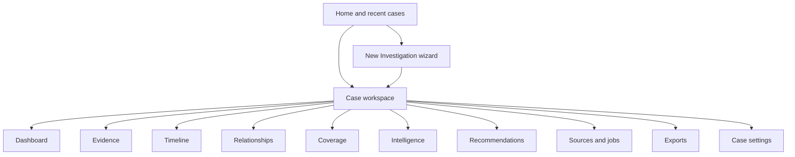

# GUI and Interaction Design

## UX goal

The desktop interface should feel like a focused investigation notebook: guided enough for a junior analyst, dense enough for an experienced responder, and transparent enough that neither has to trust unexplained automation.

The design optimizes for this loop:

```text
create -> import -> run -> review -> pivot -> assess -> export
```

It does not imitate a generic admin dashboard. Evidence, source coverage, and investigative actions remain the center of every screen.

## Information architecture



## Application shell

```text
+--------------------------------------------------------------------------------+
| IOC Evidence Packager     Case: IR-2026-001     [Offline]   [Jobs 1]   [Export]|
+------------------+-------------------------------------------------------------+
| Dashboard        | Case title / current view                       [Search...] |
| Evidence         |-------------------------------------------------------------|
| Timeline         |                                                             |
| Relationships   |                     Main content                            |
| Coverage         |                                                             |
| Intelligence    |                                                             |
| Recommendations |                                                             |
| Sources          |-------------------------------------------------------------|
| Exports          | Status: Ready for review | 3 warnings | Last saved 14:32    |
| Settings         |                                                             |
+------------------+-------------------------------------------------------------+
```

Persistent shell elements:

- case name, status, and active run;
- visible network/privacy badge such as Offline or Safe Enrichment;
- background-job indicator with progress/cancel access;
- global case search across evidence IDs, observables, entities, and notes;
- save/recovery state and unresolved warning count;
- one Export action that opens profiles rather than immediately writing files.

## Home

The Home screen shows recent cases, pinned cases, status, lead observables, last activity, source count, and warnings. Actions are Create Investigation, Open Existing Case, Import Case Capsule, and Verify Case Capsule.

Empty-state copy should explain the workflow and offer the bundled synthetic demonstration. The application must not require an account or network connection to become useful.

## New Investigation wizard

The wizard prevents accidental disclosure and bad imports before expensive work begins.

### Step 1: Case and lead

Fields:

- case title and optional external case/ticket ID;
- one lead observable, with auto-detected type and visible normalized preview;
- requested start/end time and display time zone;
- short reason/source for the lead;
- optional tags and analyst notes.

Validation happens inline. The original input remains visible beside the normalized value. A malformed value cannot proceed, and the error explains the expected form.

### Step 2: Evidence sources

The analyst adds files or folders. A source table shows:

| Column | Purpose |
|---|---|
| Source | Safe display name and resolved location |
| Size | Warn about expensive inputs |
| SHA-256 | Pending, calculating, or completed |
| Detected format | Adapter and confidence/reason |
| Time coverage | Earliest/latest parsed sample when safe |
| Compatible recipes | IP, domain, URL, or hash capabilities |
| State | Ready, needs mapping, unsupported, warning, failed |

Selecting a row opens a preview with redacted sample records, field mappings, timestamp assumptions, and parser warnings. Raw values are displayed as plain text.

### Step 3: Mapping and assumptions

For generic formats, the analyst maps source fields to canonical concepts. The UI supports:

- field browser with sample values;
- canonical targets and compatible types;
- timestamp format and source time zone;
- multi-value separators only when explicitly chosen;
- save mapping as a named local profile;
- validation that highlights ambiguous or lossy mappings.

The mapping preview explains which search recipe steps become possible. Unknown fields may remain preserved in the raw record without being normalized.

### Step 4: Privacy and intelligence policy

The default selection is Offline. Other profiles list each enabled connector, value sent, purpose, authentication state, cache policy, and provider note.

Example disclosure preview:

```text
Will leave this workstation
  - SHA-256 value -> CIRCL hashlookup
  - Domain value -> ThreatFox

Will remain local
  - source files and raw records
  - hostnames, usernames, paths, notes, and case title
```

No unchecked provider is contacted. The confirmation cannot be hidden behind generic terms such as "improve results."

### Step 5: Review and run

The final page summarizes lead, requested interval, files, adapters, mappings, expected telemetry categories, privacy policy, estimated workload, and blocking warnings.

Starting creates the case and an immutable job specification. The wizard closes into the case workspace with a progress panel; it does not freeze while processing.

## Dashboard

The Dashboard answers "what did we learn and how reliable is that view?"

Recommended layout:

```text
+----------------------+----------------------+-------------------------------+
| Lead observables     | Direct sightings     | Coverage warnings             |
| 1 hash, 2 pivots     | 12 on 2 hosts        | DNS partial / Proxy missing   |
+----------------------+----------------------+-------------------------------+
| Timeline sparkline and first/last seen                                      |
+--------------------------------------------+---------------------------------+
| Affected entities                           | Recommended next actions        |
| Hosts 2 | Users 1 | Processes 4 | Files 3  | 1 Immediate | 3 Useful          |
+--------------------------------------------+---------------------------------+
| Key evidence / bookmarks                   | Intelligence assertions         |
+--------------------------------------------+---------------------------------+
| Limitations and analyst assessment                                            |
+--------------------------------------------------------------------------------+
```

Counts link to filtered views. Coverage warnings appear at the same visual weight as findings. The Dashboard never labels a host "compromised" unless that exact analyst assessment exists.

## Evidence view

The Evidence view is the principal investigation surface.

### Table behavior

Default columns: time, classification, observable/match, host, user, process, file or destination, source, review state, warnings.

Required interaction:

- composable filters with removable filter chips;
- saved views scoped to the case;
- column chooser and density modes;
- stable sorting and paginated/virtualized loading;
- multi-select for bookmarks, review state, and export inclusion only;
- right-click or action menu to pivot an observable, copy a safe value, or open provenance;
- no direct editing of normalized fact cells.

### Table detail windows

Single-clicking a detail-bearing row opens a reusable non-modal window instead of inserting a
drawer beneath the table. This rule applies to Evidence, Rejections, Timeline, Coverage,
source previews, and export history. The main table therefore keeps the full workspace height,
while analysts can leave a detail window open, move it to another monitor, copy its contents,
or click another row to reuse it. Navigation tables such as Recent cases retain their native
open/select behavior.

Evidence detail tabs planned for later iterations:

Tabs:

1. **Summary:** canonical fields and plain-language inclusion reason.
2. **Provenance:** source digest, adapter/version, record position, recipe/rule, normalization.
3. **Raw:** syntax-highlighted but safely escaped record, with size limits and copy warning.
4. **Relationships:** typed edges and supporting evidence.
5. **Notes:** annotations, bookmark, review state, and export disposition.

The detail view always shows whether the item is a direct sighting, a pivot result, a context event, or analyst-added material.

## Timeline

The Timeline uses synchronized lanes for direct matches, context, and selected entities. It supports:

- zoom and bounded interval selection;
- filter synchronization with the Evidence view;
- time-zone toggle while retaining UTC internally;
- source/entity colors that remain distinguishable without color alone;
- event clustering at low zoom and exact rows at high zoom;
- an undated lane for records without a trustworthy time;
- jump to raw evidence and add to a bookmarked sequence.

A narrative ordering is an analyst-created view, not a mutation of chronological facts.

## Relationships

The default graph shows the lead, direct sightings, and one-hop entities. A side panel explains the selected node or edge and lists supporting evidence IDs.

Controls:

- node-type and time filters;
- expand one selected pivot, never unbounded auto-expansion;
- group repeated events without losing count/source links;
- pin nodes and save a graph view;
- switch to an accessible relationship table;
- hide intelligence or context layers independently.

Edges use verbs such as `resolved-to`, `connected-to`, `executed`, or `observed-on`; vague edges such as `related-to` require an explicit rule and explanation.

## Coverage

```text
+----------------------+-----------+----------+----------+-------------------------+
| Recipe / telemetry   | WS-014    | WS-022   | WS-031   | Reason / action         |
+----------------------+-----------+----------+----------+-------------------------+
| Endpoint execution   | MATCH     | NO MATCH | PARTIAL  | 87 rejected records     |
| DNS resolution       | MATCH     | NO MATCH | MISSING  | Request DNS export      |
| Proxy connection     | MATCH     | MISSING  | MISSING  | No source supplied      |
| Hash reputation      | OFFLINE   | OFFLINE  | OFFLINE  | Policy disabled         |
+----------------------+-----------+----------+----------+-------------------------+
```

The real implementation uses the normative coverage states; display labels may be shorter. Each cell opens its calculation: expected capability, supplied sources, intervals, accepted/rejected counts, matching result, and recovery action.

Network-policy-disabled intelligence is shown separately from evidence coverage so an offline choice is not mistaken for a parser or telemetry failure.

## Intelligence

Provider cards remain independent. Each shows query, retrieval time, provider, normalized claims, raw-response availability/hash, cache age, and error/rate-limit state. Conflicts are shown side by side.

Actions include retry under policy, open official provider page, add a returned observable as a case pivot, and mark relevance. Adding a pivot records the originating assertion; it does not convert that assertion into a local sighting.

## Recommendations

Recommendations are grouped by Immediate, Useful, and Optional. Each card contains rationale, evidence/coverage links, safety note, expected value, and suggested tool/query.

The analyst can Accept, Mark Completed, or Dismiss with a reason. Accepted actions create activity entries. An integration may prepare a handoff but never executes remote collection or remediation without a separately explicit workflow.

## Sources and jobs

### Sources

Displays source location/reference mode, digest, adapter/version, byte and record counts, time bounds, entity bounds, warnings, mapping profile, and raw availability. Re-import creates a new source/run relationship when bytes or mapping versions change.

Implemented in v0.6.0 as a filterable full-height inventory. Ready, Warning, Unsupported, and Failed states remain visually distinct; accepted/rejected counts are calculated per source; and a single row click opens the common non-modal detail window with the complete digest, adapter/version, mapped fields, capabilities, time bounds, preview limitations, and import diagnostics.

### Jobs

Displays stage, progress, throughput when meaningful, current source, warning count, elapsed time, and Cancel. History includes succeeded, partial, failed, and cancelled jobs with concise recovery actions and expandable technical logs.

## Exports

The export workflow is a review, not a file-format dropdown:

1. select Full Internal, Redacted Shareable, Executive, Machine Handoff, or later Platform Handoff;
2. choose included runs, evidence review states, notes, intelligence, and attachments;
3. preview redactions and unresolved warnings;
4. select a validated destination;
5. generate as a background job;
6. show artifact hashes and verification result;
7. offer Open Folder and Verify, but do not automatically upload or send.

Export history records profile, redaction policy version, artifact list, destination, and hash verification.

## Settings

### Case settings

Display time zone, privacy policy, source reference/copy mode, safe display options, mapping profiles, and case storage behavior.

### Application settings

Workspace location, appearance, update behavior, provider configuration, credential-store status, cache limits, diagnostics, and accessibility preferences.

Changing a privacy policy affects future jobs only. Historical runs retain the policy under which they executed.

## Progress, errors, and recovery

- Use inline, actionable errors near the affected source or setting.
- Reserve modal dialogs for destructive confirmation, credential prompts, or decisions that block all progress.
- Never expose raw evidence in notifications or default logs.
- Failed sources remain in inventory with retry/remap/remove actions.
- Crash recovery reopens the last consistent case state and marks interrupted jobs accurately.
- An empty result displays coverage and next steps, not a celebratory "No threats found."

## Accessibility and expert efficiency

- Full keyboard navigation and visible focus.
- Text or icon plus color for states; color is never the only signal.
- Respect OS scaling and provide density modes.
- Accessible table alternatives for graph and timeline summaries.
- Copyable stable evidence IDs and deep links within the case.
- Command palette for navigation and safe, non-destructive actions.
- Saved filters and case templates for recurring workflows.
- Destructive actions require clear target names and do not share shortcuts with review actions.

## UX language rules

Prefer:

- "Observed in 3 records" over "Threat detected."
- "Searched with no match" over "Clean."
- "Source not provided" over "No activity."
- "Provider assertion" over "Confirmed malware."
- "Suggested next action" over "Required remediation."
- "Context event" over "Related attack."

## First prototype sequence

1. Application shell and recent-cases Home.
2. New Investigation wizard with offline policy.
3. Background supported-source import with progress/cancel.
4. Evidence table and non-modal provenance/raw detail window.
5. Coverage matrix with all six states.
6. Dashboard and basic timeline.
7. Export review and deterministic HTML/JSONL output.

Relationship graph, intelligence, and recommendations follow only after the evidence and coverage interactions test well with the synthetic case.
