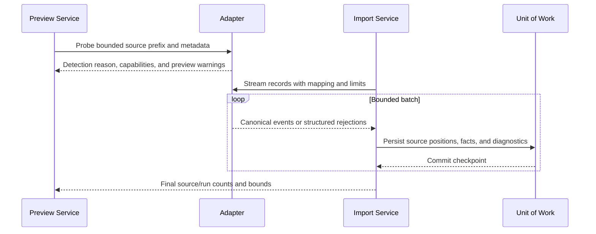

# Implementation Blueprint

## Purpose

This blueprint turns the product documents into an ordered engineering plan. It specifies boundaries and contracts strongly enough to begin implementation while leaving replaceable technology choices behind interfaces.

## Frozen decisions for the first slice

| Decision | Choice | Consequence |
|---|---|---|
| Primary interface | PySide6 desktop application | Design the workflow visually from day one |
| Core boundary | Headless domain and application services | Qt widgets never implement evidence rules |
| Durable database | SQLite | A case is portable and needs no service |
| Initial source | Canonical JSONL | One controlled adapter proves the pipeline |
| Initial observables | IPv4, domain, SHA-256 | Small set with meaningfully different normalization |
| Initial policy | Offline | Network is not needed for an end-to-end case |
| Initial outputs | JSONL, JSON, self-contained HTML | Machine and human review from one projection |
| Work execution | Application job coordinator plus Qt worker adapter | Imports are cancellable and UI-safe |
| IDs | Application-generated case/run IDs plus content-derived source/event identities | Stable references without pretending universal identity |
| Evidence authority | Deterministic rules and preserved sources | No LLM or provider decides which local records are facts |

Do not add DuckDB, a graph library, provider SDKs, PDF, plugin discovery, or packaging tools until the slice that needs them.

## Project layout to implement

```text
src/ioc_evidence_packager/
|-- __init__.py
|-- __main__.py
|-- domain/
|   |-- models.py
|   |-- observables.py
|   |-- evidence.py
|   |-- coverage.py
|   |-- policies.py
|   |-- recommendations.py
|   `-- errors.py
|-- application/
|   |-- commands.py
|   |-- queries.py
|   |-- services.py
|   |-- jobs.py
|   |-- events.py
|   `-- ports.py
|-- presentation/
|   `-- desktop/
|       |-- app.py
|       |-- main_window.py
|       |-- navigation.py
|       |-- jobs.py
|       |-- viewmodels/
|       |-- views/
|       `-- dialogs/
|-- ingestion/
|   |-- base.py
|   |-- registry.py
|   |-- canonical_jsonl.py
|   `-- diagnostics.py
|-- matching/
|   |-- engine.py
|   `-- recipes/
|       |-- ip.py
|       |-- domain.py
|       `-- sha256.py
|-- storage/
|   `-- sqlite/
|       |-- connection.py
|       |-- repositories.py
|       |-- unit_of_work.py
|       `-- migrations/
|-- coverage/
|   `-- evaluator.py
|-- recommendations/
|   `-- engine.py
|-- intelligence/
|   |-- policy.py
|   |-- cache.py
|   `-- providers/
|-- reporting/
|   |-- model.py
|   |-- jsonl.py
|   |-- manifest.py
|   `-- html.py
`-- integrations/

tests/
|-- unit/
|-- integration/
|-- ui/
|-- security/
|-- fixtures/
`-- golden/
```

## Dependency direction

```text
presentation -> application -> domain
infrastructure -> application ports + domain
domain -> Python standard library only where practical
```

The application layer defines ports such as `CaseRepository`, `SourceRepository`, `EvidenceRepository`, `AdapterRegistry`, `ArtifactRenderer`, `Clock`, `IdGenerator`, and later `EnrichmentProvider`. Infrastructure implements those ports.

Domain models should be immutable value objects where mutation has no meaning. Persistence models and Qt models are adapters, not aliases of domain types.

## Application use cases

### Commands

- `CreateCase`
- `UpdateCaseMetadata`
- `AddObservable`
- `PreviewSources`
- `StartInvestigationRun`
- `CancelJob`
- `AnnotateEvidence`
- `SetEvidenceReviewState`
- `CreateAssessment`
- `EvaluateCoverage`
- `GenerateCaseCapsule`

### Queries

- `ListRecentCases`
- `GetCaseSummary`
- `ListEvidence`
- `GetEvidenceDetail`
- `GetTimelinePage`
- `GetCoverageMatrix`
- `GetSourceInventory`
- `ListJobs`
- `GetExportPreview`

Commands return identifiers/outcomes and publish application events. Queries return immutable view data with pagination; widgets do not hold database cursors.

## Job contract

```text
JobSpecification
  job_id
  case_id
  job_type
  immutable parameters
  requested_at

JobProgress
  stage
  source_id or display-safe source name
  completed_units / total_units when known
  accepted_count
  rejected_count
  warning_count
  cancellable

JobOutcome
  status
  committed checkpoint or run_id
  summary counts
  structured warnings/errors
```

The application coordinator owns cancellation tokens and job state. A Qt adapter schedules work and converts progress callbacks to signals. This keeps tests independent of the event loop.

## First database conception

The names below describe logical tables; migrations may refine columns and indexes.

| Table | Important fields |
|---|---|
| `case_record` | ID, title, status, requested interval, display zone, created/updated times |
| `observable` | ID, case ID, type, original, canonical, role, origin reference |
| `policy_snapshot` | ID, case/run ID, kind, version, canonical configuration JSON |
| `job` | ID, case ID, type, state, stage, counts, start/end, error code |
| `run` | ID, case ID, parent run, recipe versions, status, start/end |
| `source` | ID, digest, size, safe name, reference/copy mode, adapter/version |
| `run_source` | run/source mapping, status, accepted/rejected counts, time/entity bounds |
| `event` | ID, source ID, position, adapter major version, original/UTC time, canonical JSON, raw reference |
| `event_observable` | event, type, field path, original, canonical |
| `sighting` | ID, run, event, observable, class, rule ID, explanation data |
| `relationship` | ID, run, source/target entity, type, rule ID, support JSON |
| `coverage_cell` | ID, run, recipe step, telemetry, entity scope, interval, state, reason JSON |
| `annotation` | ID, case, target type/ID, author label, text, created time, supersedes ID |
| `assessment` | ID, case, title, conclusion, confidence vocabulary, rationale, citation JSON |
| `recommendation` | ID, run, rule, priority, state, rationale data, citation JSON |
| `intel_assertion` | ID, provider, observable, retrieved/data times, normalized JSON, raw hash, cache metadata |
| `export_record` | ID, case, profile/policy versions, destination, state, artifact index |
| `schema_metadata` | database schema version and migration history |

### Important indexes

- case/update time;
- canonical observable type/value;
- event normalized time;
- source digest plus source position;
- event-observable canonical value plus type;
- sightings by run, observable, event, and class;
- coverage by run/state/telemetry;
- jobs by case/state.

FTS is optional and should be introduced only for analyst text or bounded canonical content with clear privacy/performance tests. It is not the first structured matching engine.

## Canonical event envelope

```json
{
  "schema": "canonical-event/1.0.0",
  "event_id": "event:...",
  "source": {
    "source_id": "source:...",
    "position": {"kind": "line", "value": 42}
  },
  "time": {
    "original": "2026-08-06T14:10:03+01:00",
    "utc": "2026-08-06T13:10:03Z",
    "precision": "second",
    "assumptions": []
  },
  "event": {"category": "network", "action": "connection"},
  "host": {"name": "WS-014"},
  "user": {"name": "alice"},
  "process": {"name": "powershell.exe", "pid": 4420},
  "network": {"destination_ip": "203.0.113.42"},
  "observables": [],
  "adapter": {"id": "canonical-jsonl", "version": "1.0.0"},
  "warnings": [],
  "raw": {"mode": "source-reference"}
}
```

The envelope is illustrative. Before code is merged, define a formal schema and mapping rules; do not let fixtures accidentally become an undocumented schema.

## Observable value objects

Each observable implementation exposes:

- original display value;
- canonical comparison value;
- exact type;
- validation errors with safe codes/messages;
- derived components used by recipes, such as registrable domain;
- serialization version.

Value objects do not perform DNS queries, reputation checks, database access, or UI formatting.

## Adapter execution



Hash source bytes in a streaming pass or safely combine hashing/import only when a changed file cannot produce an inconsistent identity. The first implementation can hash before import for clarity.

## Search recipe interface

A recipe declares:

```text
id and semantic version
supported observable type
compatible canonical field capabilities
direct-match rules
optional pivot rules
optional bounded context rules
expected telemetry categories
coverage steps
recommendation hooks
```

Rules produce structured explanations with template ID and safe parameters, not only pre-rendered English. This supports consistent GUI, report, localization, and tests.

## Coverage evaluator algorithm

For each required recipe step and entity/time scope:

1. identify adapters/sources capable of the step;
2. determine whether applicable sources were supplied;
3. determine whether their format, parsing, entity scope, fields, and time bounds cover the request;
4. determine whether the step completed or failed;
5. check whether it produced one or more matches;
6. emit the normative state and structured reasons;
7. link sources, jobs, warnings, and sightings that support the result.

State precedence must be specified in tests. A useful starting rule is:

- unsupported supplied format -> `FORMAT_UNSUPPORTED`;
- applicable supplied source with fatal processing failure -> `SOURCE_FAILED`;
- no applicable source -> `SOURCE_NOT_PROVIDED`;
- incomplete compatible search -> `PARTIAL_COVERAGE`;
- complete compatible search with a result -> `MATCH_FOUND`;
- complete compatible search without a result -> `SEARCHED_NO_MATCH`.

Mixed sources may require aggregate `PARTIAL_COVERAGE` even when one source has matches. Preserve per-source cells so the aggregate reason is inspectable.

## Report-model construction

The report builder queries a consistent read snapshot and constructs a versioned immutable projection containing:

- case/run metadata;
- observables and normalized displays;
- source inventory;
- evidence and provenance;
- timeline and entity summaries;
- coverage and limitations;
- intelligence assertions;
- recommendations and analyst assessments;
- policy and version metadata.

The GUI can use smaller query projections for performance, while the semantic labels and explanations come from the same domain/application output. Renderers never run match queries.

## Error taxonomy

Define stable, safe error codes by boundary:

- `OBSERVABLE_INVALID`;
- `SOURCE_UNREADABLE`, `SOURCE_CHANGED`, `FORMAT_AMBIGUOUS`, `FORMAT_UNSUPPORTED`;
- `RECORD_TOO_LARGE`, `RECORD_MALFORMED`, `TIMESTAMP_AMBIGUOUS`;
- `MAPPING_INVALID`, `ADAPTER_SCHEMA_DRIFT`;
- `JOB_CANCELLED`, `DATABASE_BUSY`, `DATABASE_MIGRATION_FAILED`;
- `POLICY_DENIED`, `PROVIDER_RATE_LIMITED`, `PROVIDER_SCHEMA_DRIFT`;
- `OUTPUT_PATH_UNSAFE`, `OUTPUT_EXISTS`, `MANIFEST_VERIFY_FAILED`.

Exceptions may retain a technical cause for local diagnostics, but user messages and normal logs do not include raw records or secrets.

## Implementation slices

### Slice 1: bootable shell and case persistence

- add PySide6 dependency and application entry point;
- create main window, navigation placeholders, and offline badge;
- implement SQLite connection, migration runner, case repository, and Create/Open Case;
- add headless service tests and a Qt smoke test.

**Demo:** create a case, close the app, reopen it, and see accurate metadata.

### Slice 2: lead validation and source preview

**Status: implemented in v0.2.0.**

- implement IPv4/domain/SHA-256 value objects;
- define canonical JSONL schema and reference fixture;
- hash/preview a source with adapter capabilities and safe warnings;
- implement wizard steps 1-3.

**Demo:** enter a lead and see exactly how one file will be interpreted before import.

### Slice 3: background import and evidence ledger

**Status: implemented in v0.3.0.**

- implement job coordinator/cancellation;
- stream canonical JSONL in batches into SQLite;
- expose progress and structured rejections;
- build Evidence table plus provenance/raw detail.

**Demo:** import, cancel safely, retry, and trace a record to its source line.

### Slice 4: matching and coverage

**Status: implemented in v0.4.0.**

- implement three recipes and structured direct-match explanations;
- implement all six coverage states and Coverage view;
- add planted matches/lookalikes/missing/partial/failed sources.

**Demo:** show why a match exists and why a no-match does not imply safety.

### Slice 5: dashboard, timeline, and capsule

**Status: implemented in v0.5.0.**

- build the shared report model;
- add Dashboard and basic Timeline;
- render HTML, evidence JSONL, coverage/inventory JSON, and manifest;
- verify hashes and add export history.

**Demo:** complete the north-star synthetic case entirely offline.

### Slice 6: practical adapters and source inventory

**Status: implemented in v0.6.0.**

- extend the adapter contract from bounded probe to source-linked iteration;
- add Suricata eve.json, Wazuh alerts, Hayabusa JSONL, bounded generic JSON-array, and explicit CSV mapping-profile adapters;
- keep ambiguous CSV unsupported unless an adjacent versioned `.ioc-map.json` sidecar declares its semantics;
- surface adapter/version, source digest, capabilities, time bounds, evidence/rejection counts, warnings, and diagnostics in Sources;
- add schema-drift, mixed-time-zone, idempotent multi-adapter import, and safe-fixture performance tests.

**Demo:** import six format families into one ledger and prove that each row retains the exact source digest and position.

Each slice ends in a working application and tests. Do not build all infrastructure before the first visible workflow.

## Testing strategy

### Unit tests

- observable validation/normalization and lookalikes;
- timestamp and field mappings;
- recipe rules and explanations;
- coverage state precedence;
- recommendation conditions;
- redaction transforms and path validation.

### Integration tests

- migration from every released schema;
- import batches, cancellation, retry, and changed-source detection;
- multi-source matching and coverage;
- deterministic report model and Case Capsule verification;
- cache and policy behavior using fake connectors.

### UI tests

- application starts without network;
- wizard validation and disclosure preview;
- background progress/cancel leaves correct state;
- evidence filters and detail provenance;
- coverage cells open their reasons;
- export preview blocks unsafe destinations.

Prefer testing view models/application services over brittle pixel-coordinate automation, with a small number of real Qt end-to-end smoke tests.

### Security tests

- HTML/script/rich-text injection;
- CSV formula injection;
- traversal, absolute paths, reserved names, symlink/reparse escapes;
- malformed Unicode, JSON depth, oversized records, and decompression bombs when archives arrive;
- SQL metacharacters and wildcard lookalikes;
- secret and raw-record leakage in errors/logs;
- PDF remote/local resource access when PDF is introduced.

### Golden synthetic incident

The reference case should include:

- one suspicious hash, one discovered domain, and one IP pivot;
- two affected hosts and one benign lookalike host;
- endpoint execution/process ancestry, DNS, and proxy-style records;
- a duplicate, malformed line, ambiguous timestamp, and malicious-looking HTML string;
- one source ending before the requested interval;
- one host with missing DNS/proxy coverage;
- an optional fake-provider assertion contradicting another assertion;
- expected evidence IDs, coverage cells, recommendations, and capsule artifacts.

## Quality gates

Every merge should run formatting/lint, strict type checking, unit/integration tests, and a headless Qt smoke test when presentation code changes. Golden output is reviewed deliberately; tests must never update it automatically.

Release gates add installer testing, clean-machine launch, upgrade/migration, crash recovery, large fixture performance, offline network verification, capsule verification, and dependency/license review.

## Performance budgets to establish

Do not promise arbitrary scale. Measure and publish:

- application cold start;
- case open time at reference size;
- records/second and peak memory for each adapter fixture;
- evidence page/filter response time;
- cancellation latency;
- capsule generation time and size.

Add DuckDB or new indexes only in response to profiler evidence and preserve identical domain results.

## Dependency introduction rule

A dependency is added only when the implementing slice uses it, its license and maintenance are reviewed, it has a constrained responsibility, and its failure mode does not compromise evidence semantics. Planned choices in documentation are not yet runtime dependencies.

## Ready-to-implement checklist

Before Slice 1 begins:

- approve the PySide6/headless-core decision;
- select a first schema-migration approach;
- define case workspace location and source reference/copy behavior;
- add initial domain/application package directories;
- create the first database migration and migration tests;
- sketch the Home, shell, and New Case dialog in Qt widgets;
- define stable IDs, `Clock`, and `IdGenerator` test doubles;
- add a CI-compatible offscreen Qt smoke command.

The remaining details should be decided inside the slice that proves them, recorded in the architecture documentation, and protected by tests.
