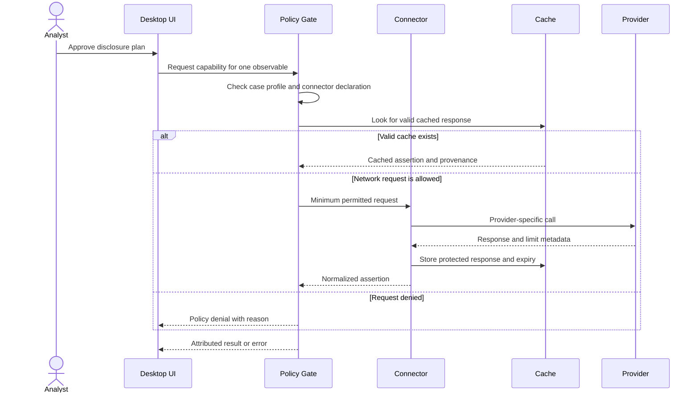

# Integrations and Enrichment

## Strategy

Integrations should make the local evidence story richer or easier to hand off without turning the core into a SIEM, collector, or intelligence platform.

There are three independent connector families:

1. **Evidence adapters** parse files already supplied to the application.
2. **Enrichment connectors** query approved intelligence or registration services.
3. **Platform connectors** perform explicit read-only searches or outbound handoffs.

A connector implements one or more declared capabilities. The GUI enables only actions supported by the connector and permitted by the active case policy.

## Evidence-adapter priorities

| Priority | Source | Approach | Value |
|---|---|---|---|
| P0 | Canonical JSONL | Native reference adapter | Proves contracts and golden tests |
| P0 | Generic JSON/CSV | User mapping profiles | Covers ad hoc exports without vendor branching |
| P1 | Wazuh JSON | Versioned selected-schema adapter | Relevant SOC alert and endpoint evidence |
| P1 | Hayabusa JSONL | Consume established Windows event triage output | Avoids reimplementing EVTX parsing/rules |
| P1 | Suricata `eve.json` | Event-type-aware JSON adapter | Network, DNS, TLS, HTTP, alert context |
| P2 | Zeek TSV/JSON | Log-type adapters | Rich network pivots |
| P2 | Plaso output | Import documented timeline exports | Interoperate with forensic tooling |
| P2 | Velociraptor results | Artifact/result mapping profiles | Endpoint collection handoff |
| P2 | Elastic Common Schema | ECS field-capability mapping | Vendor-neutral normalized exports |
| P3 | Parquet and OCSF | Generic columnar/schema adapters | Larger and cloud-oriented data |

Native EVTX parsing is deferred. Hayabusa and similar established tooling can produce structured output while the packager concentrates on evidence compilation, provenance, coverage, and handoff.

## Adapter capability contract

An adapter declares:

- stable adapter ID and semantic version;
- recognized media/format/schema signatures;
- canonical fields it can produce;
- compatible observable types and recipe steps;
- timestamp formats, time-zone assumptions, and precision;
- streaming/random-access behavior and resource limits;
- source-position strategy;
- warnings/rejections with stable error codes;
- fixtures and supported vendor/schema versions.

Detection returns reasons and confidence metadata, but ambiguous selection requires analyst confirmation. Adapters never decide maliciousness.

## Enrichment provider priorities

Provider capabilities and terms change. Implementations must re-check official documentation, licensing, authentication, limits, and permitted use before release.

| Provider/data | Observable types | Intended use | Priority and guardrail |
|---|---|---|---|
| Public Suffix List | Domain | Registrable-domain parsing | P0 local data dependency; version it |
| MITRE ATT&CK STIX | Technique/software references | Explain analyst mappings and exports | P1 locally cached dataset; do not auto-attribute |
| RDAP | IP/domain | Registration and allocation context | P1; cache and respect bootstrap/rate behavior |
| CIRCL hashlookup | Hash | Known-file lookup, including local/offline options | P1; prefer local dataset mode when available |
| ThreatFox | IP/domain/URL/hash | Community IOC assertions | P1; label provider confidence and recency |
| URLhaus | URL/domain/hash | Malware URL/payload relationships | P1; never download a payload automatically |
| MalwareBazaar | Hash | Malware sample metadata | P1 metadata only by default; no sample download |
| GreyNoise Community | IP | Internet scanner/noise context | P1; display scope and plan limits |
| AbuseIPDB | IP | Abuse reports | P2 optional key; reports are assertions, not proof |
| VirusTotal | IP/domain/URL/hash | Multi-engine/provider context | P2 BYOK; public API limits and non-commercial constraints matter |
| Internal MISP/OpenCTI | Multiple | Organization-specific intelligence | P2 enterprise/local policy |

No provider list is a promise of equal support. A small number of reliable connectors with correct policy, caching, provenance, and tests is preferable to many shallow wrappers.

## Enrichment result model

Provider output is stored as an **intelligence assertion**, not a local event. Required metadata:

- provider and connector version;
- capability/endpoint and observable queried;
- retrieved time, provider data time when available, and cache expiry;
- normalized claims with provider-specific confidence vocabulary preserved;
- raw-response hash and optional protected raw body;
- response status, rate-limit information, and errors;
- policy and disclosure decision that permitted the call;
- licensing/redistribution restrictions relevant to export.

Provider results are never averaged into a universal score. The UI can sort or summarize them, but the underlying claims remain attributable and may conflict.

## Privacy and request policy

Every request passes a policy gate before a connector receives it.

Policy categories:

- public observable value;
- organizational identifier;
- case metadata;
- raw event;
- file/sample;
- credential/secret.

Safe Enrichment permits only explicitly approved public observable values. Files/samples and raw events require a different, narrowly authorized workflow and are outside the default connector contract.

## Caching and rate limits

- Cache keys include provider, capability, canonical observable, relevant request options, and connector major version.
- TTL comes from provider metadata or a documented connector policy.
- Expired data remains visible as stale only when labeled and never silently substitutes for a fresh request.
- Persist raw-response hash even when redistribution rules prevent exporting the raw response.
- Backoff honors provider headers and avoids retry storms.
- A partially enriched investigation remains valid; provider failure changes intelligence coverage, not local evidence coverage.

## Secrets

API tokens use the operating-system credential store when practical. Configuration contains secret references, never plaintext tokens. Secrets are excluded from case databases, diagnostics, exports, screenshots, and exception text.

The application supports connector health checks that reveal authentication status without displaying the secret.

## Read-only search integrations

### Wazuh / OpenSearch

An enterprise connector may run prebuilt, parameterized, read-only IOC queries against authorized indices and import returned records with query provenance. It must record endpoint identity, index/time range, query template version, paging/truncation, and server errors.

### Timesketch

Import selected search results or export a focused timeline through the documented API. Preserve sketch/timeline/event identifiers and do not claim local source-file hashes for remote-only events.

### Velociraptor

Prefer importing completed artifact results. Its API can initiate powerful collection; any active collection belongs in a separately authorized integration, with a conspicuous confirmation and no automatic recommendation execution.

### SIEM and cloud platforms

Splunk, Microsoft Sentinel, Elastic/OpenSearch, and cloud log sources are later connector candidates. Each needs pagination, time-zone, truncation, access-control, query-provenance, and cost safeguards; generic "SIEM connector" behavior is not sufficient.

## Handoff integrations

### TheHive

Create or enrich an authorized case/alert with selected observables, findings, attachments, and a link or receipt. The user previews all fields before creation or update.

### MISP

Export selected observables/sightings and supporting context using PyMISP or a reviewed STIX/MISP mapping. Distribution, sharing groups, tags, and confidence must be explicit.

### OpenCTI

Export selected STIX-aligned observables, sightings, relationships, and reports or use a connector/bundle workflow. Avoid creating duplicate or overconfident objects from local context.

### Timesketch

Export a selected, source-attributed timeline with tags/comments when supported. The packager remains the capsule source; Timesketch becomes the deeper collaborative analysis destination.

## Connector failure rules

- Local evidence remains reviewable when all external services are offline.
- Errors identify provider/capability and recovery action without leaking secrets.
- Pagination or result limits create explicit partial-coverage metadata.
- Schema drift disables only the affected connector capability and surfaces a diagnostic.
- Platform writes require a final preview and return a receipt or object identifiers.
- No connector may silently broaden a query, upload a file, or send additional case fields.

## Testing contract

Each connector needs:

- recorded synthetic/sanitized response fixtures allowed by provider terms;
- normalization, error, rate-limit, timeout, and schema-drift tests;
- policy allow/deny and disclosure-plan tests;
- cache hit/stale/expiry tests;
- proof that secrets and raw evidence do not enter logs or exports;
- an integration test behind an explicit environment flag, never required for offline CI.

## Selection rule

Implement a connector only when it unlocks a documented analyst workflow, its data-sharing implications are understood, and its behavior can be tested without depending on a live service in the normal test suite.
