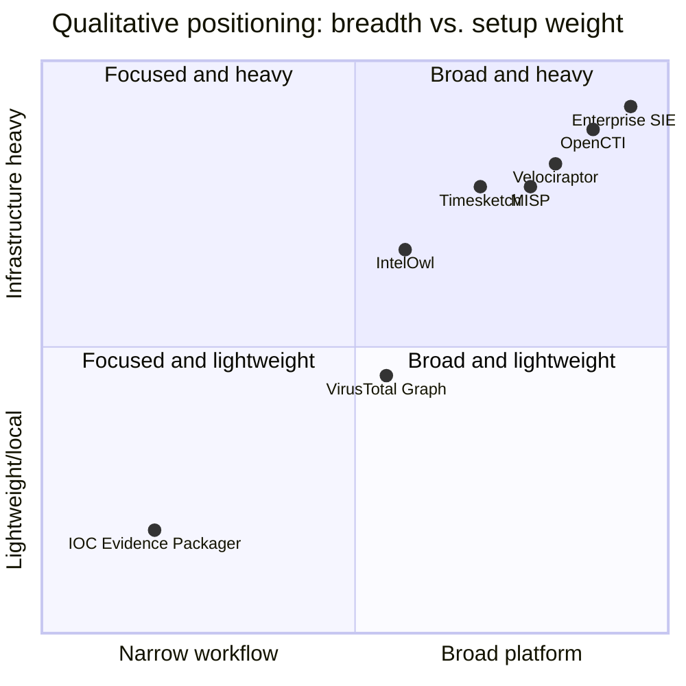

# Problem Study and Existing-Solution Analysis

## Executive summary

Security teams have strong tools for collecting telemetry, searching enterprise data, enriching observables, sharing intelligence, and analyzing forensic timelines. A smaller workflow remains awkward: package all locally available evidence for one IOC into a compact, reproducible handoff.

IOC Evidence Packager targets that workflow. It does not assume existing platforms cannot report or search indicators. The hypothesis is that a narrow, local-first, export-in/report-out tool can reduce setup and analyst effort for small teams, classrooms, and ad hoc investigations.

This is a positioning analysis based on official documentation accessed on 2026-08-05, not an exhaustive feature or performance evaluation.

## Problem statement

Given one IOC and exported logs, an analyst must locate occurrences, preserve their origin, reconstruct temporal/entity context, and communicate the result. That is difficult because:

1. **Fields differ:** the same concepts have different names and structures.
2. **Time differs:** sources use local time, UTC, epochs, or timestamps without zones.
3. **Exact matches lack context:** a value is more useful when connected to a process, user, host, and nearby activity.
4. **Manual copying loses provenance:** pasted rows often omit source, record position, original field, or settings.
5. **Handoffs vary:** the next analyst must decode notes shaped by whoever searched first.
6. **Large platforms may be unavailable:** small teams may lack licenses, infrastructure, connectors, or permission to upload evidence.

CISA incident-response guidance calls for documenting indicators for correlative analysis and sharing threat information with response teams. NIST forensic guidance treats logs and multiple data sources as important investigation material. This project addresses packaging after export; it does not replace proper acquisition.

## Jobs to be done

An analyst wants to determine whether the IOC occurs, see first/last/repeated appearances, identify affected entities, understand why each event matched, distinguish observation from inference, disclose rejected inputs, and give another person a reproducible human- and machine-readable bundle.

## Existing solution landscape

The following "relative gaps" mean a product has a different primary job. They are not claims that a capability is impossible in that product.

### MISP

MISP is an open-source threat-intelligence sharing platform for storing, correlating, analyzing, and exchanging indicators and related intelligence. Its documented features include flexible data models, automatic correlation, reports, sharing controls, APIs, and many exports.

**Excels at:** the collaborative intelligence lifecycle, structured events, communities, sharing, correlation, and interoperability.

**Relative gap:** an analyst with only a directory of exported logs still needs mappings and a workflow that turns local occurrences into a small evidence bundle. Operating and modeling data in a platform may exceed one-off or classroom needs.

### OpenCTI

OpenCTI structures, stores, organizes, and visualizes technical and non-technical cyber-threat knowledge using a knowledge-graph approach with observables, cases, dashboards, feeds, and connectors.

**Excels at:** connected threat knowledge, entity relationships, intelligence management, cases, and integrations.

**Relative gap:** its broad platform is valuable for sustained intelligence operations but heavier than a local command consuming a few exports. The packager can emit evidence for later ingestion into OpenCTI rather than duplicate its graph.

### VirusTotal Graph

VirusTotal Graph visualizes and pivots through relationships among files, URLs, domains, IP addresses, and other objects in VirusTotal's dataset.

**Excels at:** external reputation context, malware relationships, pivots, commonalities, and shareable threat maps.

**Relative gap:** VirusTotal knows its dataset, not an organization's exported DNS, proxy, authentication, and endpoint records unless separately integrated or uploaded. Privacy may also restrict external submission. This project centers local observations; future enrichment would be explicit and separate.

### IntelOwl

IntelOwl enriches observables and malware through analyzers, connectors, visualizers, and repeatable playbooks. It can query external services and internal analysis tools, then export results to platforms such as MISP or OpenCTI.

**Excels at:** scalable enrichment, analyzer orchestration, repeatable intelligence jobs, and integrations.

**Relative gap:** enrichment asks "what is known about this observable?" This project asks "where did it occur in these local logs, and what source evidence supports that?" The tools are complementary.

### Timesketch

Timesketch is an open-source collaborative forensic timeline platform. Sketches organize events across timelines with search, views, annotations, stories, analyzers, and exports.

**Excels at:** rich timeline exploration, collaboration, saved investigations, stories, and analysis across large event collections.

**Relative gap:** it is a full server/OpenSearch-backed workspace. A one-command IOC package from a handful of exports is smaller. The packager could support quick triage before Timesketch or create a focused handoff after analysis.

### Velociraptor

Velociraptor provides endpoint visibility, artifact collection, hunting, and forensic analysis. Artifact and hunt workflows can collect targeted information from one or many endpoints.

**Excels at:** live endpoint visibility, scalable collection, VQL, hunts, notebooks, and targeted acquisition.

**Relative gap:** it requires its endpoint/server workflow and focuses on obtaining or analyzing endpoint artifacts. The packager begins after collection and accepts exports from Velociraptor or other tools.

### SIEM platforms such as Splunk

SIEMs provide high-scale search, detection, correlation, dashboards, and incident workflows and are often the best place to query live organizational telemetry.

**Excels at:** centralized ingestion, indexed search, alerting, access control, retention, and enterprise investigation.

**Relative gap:** access, licensing, retention, and reporting vary. A portable tool can process approved exports and create a vendor-neutral bundle without reproducing SIEM ingestion or detection.

## Comparison matrix

| Solution | Primary job | Local exports without server | External enrichment | IOC-centered handoff | Operational weight |
|---|---|---:|---:|---:|---|
| MISP | Intelligence sharing/correlation | Not primary | Supported | Reports exist; raw-log packaging is not primary | Platform |
| OpenCTI | Threat knowledge graph | Not primary | Strong via connectors | Cases/reports exist; narrow export-in flow is not primary | Platform/connectors |
| VirusTotal Graph | Relationships in VT data | No | Primary | Shareable graph, not internal-log bundle | Cloud/API |
| IntelOwl | Observable/malware enrichment | Limited to analyzers | Primary | Analysis reports, not primarily local occurrences | Multi-service app |
| Timesketch | Collaborative forensic timelines | Imports files but needs a service/index | Via analyzers | Exports/stories; broader than one-IOC packaging | Server/OpenSearch |
| Velociraptor | Endpoint visibility/collection | Through its platform | Not primary | Collections/notebooks, not vendor-neutral exports | Server/clients |
| SIEM | Telemetry search/detection | Through platform indexing | Often | Vendor workflow varies | Enterprise platform |
| IOC Evidence Packager | Local IOC occurrence packaging | **Project focus** | Future/optional | **Project focus** | CLI/SQLite |

## The opportunity

The coordinates express design positioning, not measured benchmarks.

## Product hypothesis

For junior analysts and small SOC/DFIR teams that have exported logs but lack a consistent IOC handoff workflow, IOC Evidence Packager will reduce manual preparation by producing a deterministic, source-linked timeline and report from one command. Unlike broad intelligence or forensic platforms, it requires no server and makes provenance and match explanations first-class output.

## How to test the hypothesis

Give 3-5 learners or junior analysts the same synthetic incident and compare manual and tool-assisted workflows.

| Measure | Desired v1 evidence |
|---|---|
| Time to package a case | Lower median time than the manual workflow |
| Planted direct matches missed | Zero |
| Rejected records disclosed | All counted and explained |
| Traceability | Every event identifies source file and record |
| Repeatability | Equivalent inputs/settings produce equivalent evidence JSON |

The sample would be too small for broad statistical claims, but enough to reveal confusing output, missing context, and workflow friction.

## Risks and design responses

| Risk | Design response |
|---|---|
| Polished reports create false confidence | Separate observations, correlations, and analyst conclusions |
| Timestamp ambiguity changes the story | Preserve original time and expose time-zone assumptions |
| Vendor schemas drift | Version adapters; test fixtures; report rejected records |
| Logs leak identities or secrets | Local-first processing; future explicit redaction; no network by default |
| Log fields inject HTML/script | Auto-escape templates and sanitize links/paths |
| Normalization mutates evidence | Preserve raw records and hash inputs |
| Scope expands into a SIEM/SOAR | Enforce non-goals and prove the vertical slice first |

## Conclusion

The project is justified as a focused workflow tool, not a replacement for mature platforms. Its portfolio value comes from parsing, provenance, IOC normalization, explainable correlation, secure report generation, deterministic tests, and a clear demonstration using safe data.

See [References](REFERENCES.md) for the official sources behind this study.
