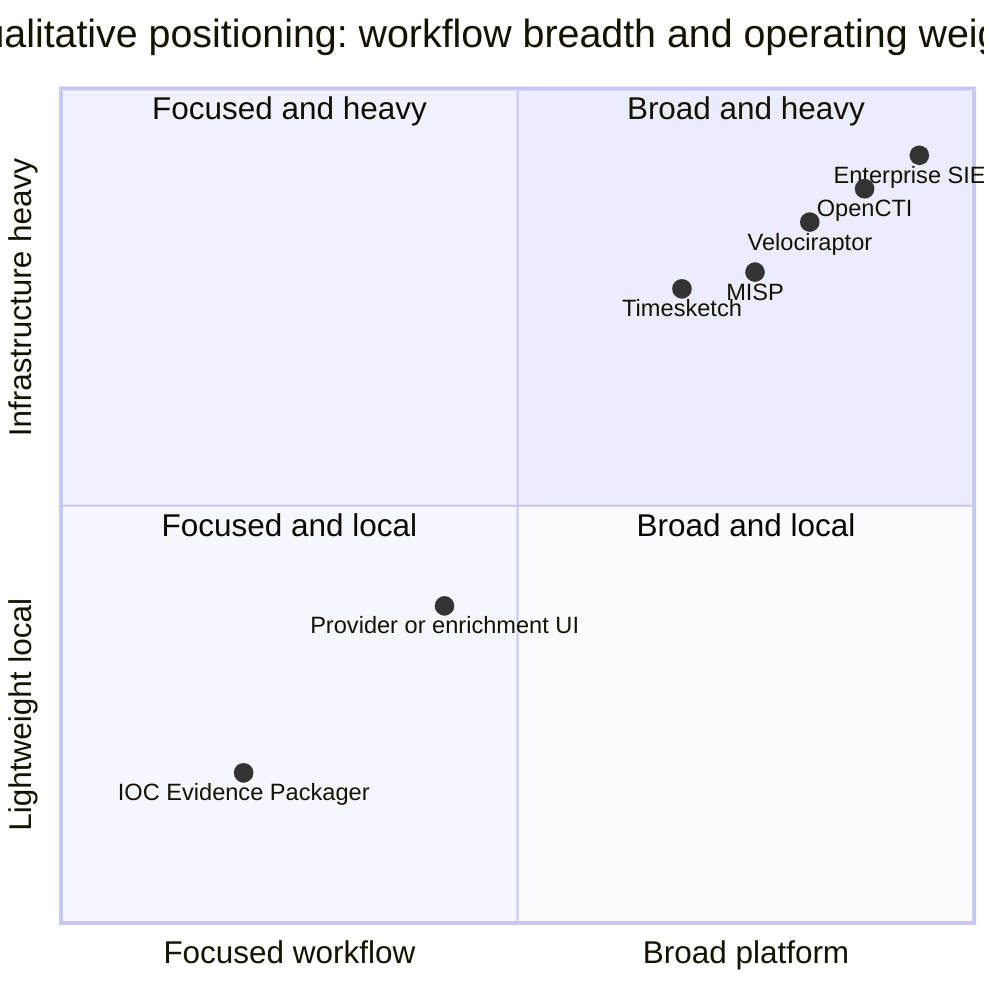

# Problem Study and Existing-Solution Analysis

## Executive summary

Security teams already have capable tools for collection, search, enrichment, intelligence sharing, forensic timelines, and case management. A narrower workflow remains inconsistent: turn a suspicious observable plus the evidence an analyst is authorized to use into a compact, reproducible, coverage-aware handoff.

IOC Evidence Packager targets that workflow as a local desktop application. Its hypothesis is not that established products cannot search or report. It is that analysts still lose time and provenance while moving between them, and that most reports do not clearly distinguish **searched with no match** from **not searched because evidence was missing, partial, failed, or unsupported**.

This positioning is based on official documentation reviewed in August 2026. "Relative gap" means a different primary product job, not a claim that a capability is impossible.

## Problem statement

Given an observable and a requested interval, an analyst must locate occurrences, validate their origin, connect useful context, understand blind spots, and communicate the result. The work is difficult because:

1. **Schemas differ.** `host`, `hostname`, `agent.name`, and similar fields may describe the same concept—or subtly different concepts.
2. **Time differs.** Sources use UTC, local time, epochs, different precision, or no zone.
3. **A direct hit is incomplete.** The value becomes actionable when connected to host, user, process, file, destination, and nearby activity.
4. **Absence is ambiguous.** No result may mean a real no-match, missing source, partial interval, parser failure, or unsupported schema.
5. **Copy/paste destroys traceability.** Tickets and spreadsheets often omit source digest, record position, original field, mapping, rejected rows, and query policy.
6. **Intelligence and observation blur.** A provider label is frequently written beside a local event as though they are the same kind of fact.
7. **Handoffs vary by analyst.** The receiver reconstructs searches and limitations instead of continuing the investigation.
8. **Privacy limits cloud workflows.** Evidence, internal names, paths, and even observables may be prohibited from external submission.
9. **Large platforms may be unavailable.** Small teams, classrooms, isolated networks, and consulting engagements may lack licenses, infrastructure, connectors, or access.

CISA incident-response guidance emphasizes documenting and sharing indicators for analysis, and NIST forensic guidance describes logs and multiple data sources as investigation material. The project begins with authorized evidence after collection; it does not replace sound acquisition.

## Jobs to be done

An analyst wants to:

- see all defensible structured sightings of the lead;
- identify affected entities and a trustworthy chronology;
- know exactly why each item was included;
- discover safe observable pivots;
- see which relevant evidence was absent or unusable;
- add external intelligence without losing attribution or privacy control;
- receive justified next-step suggestions;
- give a responder a portable human- and machine-readable case.

## Existing solution landscape

### SIEM and EDR platforms

Products such as Splunk, Microsoft Sentinel, Elastic/Wazuh, and endpoint platforms provide high-scale ingestion, indexed search, detection, dashboards, access control, and incident workflows.

**Excel at:** live organizational telemetry, alerting, search at scale, retention, and operational investigation.

**Relative gap:** access, licensing, retention, fields, and export/report behavior vary. An investigation may span products the receiver cannot access. The packager consumes approved exports or later read-only query results and creates one vendor-neutral evidence ledger with uniform provenance and coverage semantics.

### MISP

MISP manages, correlates, analyzes, and exchanges structured threat intelligence with sharing controls, APIs, events, reports, and exports.

**Excels at:** collaborative intelligence lifecycle, structured indicators, communities, correlation, sharing, and interoperability.

**Relative gap:** local occurrence search across heterogeneous raw exports is not its central job. The packager can turn local sightings and their limitations into a reviewed MISP handoff rather than imitate MISP's sharing model.

### OpenCTI

OpenCTI organizes technical and non-technical cyber-threat knowledge as a connected graph with observables, cases, reports, dashboards, feeds, and connectors.

**Excels at:** sustained intelligence knowledge, relationships, cases, feeds, and ecosystem integrations.

**Relative gap:** it is a broad platform, not a lightweight local import-and-compile workflow for one analyst with a folder of exports. IOC Evidence Packager can emit selected STIX-aligned facts and sightings after local review.

### VirusTotal Graph and observable-enrichment tools

VirusTotal Graph pivots through relationships in VirusTotal's dataset. IntelOwl orchestrates analyzers/connectors for observables and malware. abuse.ch projects, GreyNoise, CIRCL hashlookup, RDAP, and similar services provide focused external context.

**Excel at:** answering what providers know about an observable, reputation, malware relationships, registration, noise/scanner context, and repeatable enrichment.

**Relative gap:** external knowledge is not proof of what happened in the organization's supplied telemetry. Upload restrictions, provider terms, rate limits, conflicting labels, and privacy matter. The packager keeps provider assertions separate, queries only under policy, and centers local sightings and coverage.

### Timesketch

Timesketch is a collaborative forensic timeline platform with search, views, annotations, stories, analyzers, and exports over indexed timelines.

**Excels at:** rich timeline exploration, collaboration, saved investigations, and large event collections.

**Relative gap:** it requires a service/index workflow and intentionally covers a much broader timeline-analysis problem. The packager offers a smaller desktop triage and handoff path and can later send a focused timeline into Timesketch for deeper work.

### Velociraptor

Velociraptor provides endpoint visibility, VQL, artifact collection, hunts, notebooks, and forensic analysis across endpoints.

**Excels at:** targeted acquisition, live endpoint visibility, scalable collection, and endpoint-focused investigation.

**Relative gap:** acquisition and endpoint control require a very different trust model. IOC Evidence Packager starts after collection, imports artifact results, and may prepare—but not silently execute—a collection request.

### Hayabusa, Chainsaw, and Plaso

Hayabusa and Chainsaw help detect/triage Windows event logs; Plaso creates forensic super-timelines from many sources.

**Excel at:** mature parsing, rule-based event triage, and/or broad timeline production.

**Relative gap:** their structured output is valuable evidence input. Reimplementing their parsers would weaken the portfolio; the packager instead adds observable recipes, cross-source provenance, coverage semantics, guided review, and portable handoff.

### TheHive and case-management platforms

TheHive supports security incident/case workflows, observables, tasks, collaboration, and integrations.

**Excels at:** team case lifecycle, ownership, tasks, governance, and operational collaboration.

**Relative gap:** the packager is not another collaborative case system. It prepares a focused evidence set and can create/update a case only after the analyst previews the handoff.

## Comparison matrix

| Solution family | Primary job | Local export analysis without server | External intelligence | Evidence coverage semantics | Portable IOC-centered handoff |
|---|---|---:|---:|---:|---:|
| SIEM/EDR | Live telemetry, detection, response | Not primary | Often | Product/query specific | Vendor workflow specific |
| MISP/OpenCTI | Intelligence lifecycle/graph | Not primary | Strong | Intelligence coverage, not raw telemetry coverage | Reports/exports, different center |
| VT/IntelOwl/providers | Observable enrichment | Limited | Primary | Provider coverage | Intelligence result, not local evidence capsule |
| Timesketch | Collaborative timelines | Imports files but needs service/index | Via analyzers | Timeline/import dependent | Stories/exports, broader workflow |
| Velociraptor | Endpoint collection/analysis | Through its platform | Not primary | Collection status | Collections/notebooks |
| Hayabusa/Chainsaw/Plaso | Parsing, triage, timelines | Yes | Not primary | Tool-output specific | Structured source for this project |
| TheHive | Case collaboration | Not primary | Via integrations | Case/task specific | Operational case handoff |
| IOC Evidence Packager | Local evidence compilation/handoff | **Primary** | Optional and policy-controlled | **Primary differentiator** | **Primary differentiator** |

## The opportunity

Coordinates express product positioning, not measured benchmarks or rankings.

## Product hypothesis

For SOC/DFIR analysts who have a suspicious observable and authorized evidence but lack a consistent cross-tool handoff, a local coverage-aware desktop workspace will reduce preparation and review effort while improving traceability. Unlike broader platforms, it requires no server, shows evidence gaps beside findings, separates provider assertions from local facts, and exports a verifiable Case Capsule.

## How to test the hypothesis

Give learners or junior analysts the same synthetic multi-source incident, first with their normal manual process and then with the application.

| Measure | Desired evidence |
|---|---|
| Time to ready-for-review handoff | Lower median than manual workflow |
| Planted direct matches missed | Zero |
| Benign lookalikes included | Zero |
| Rejected/unsupported data disclosed | All counted and explained |
| Coverage interpretation | Users distinguish no-match from missing/partial source |
| Traceability | Every fact maps to source digest and record position |
| Review efficiency | Second analyst validates the story with fewer clarification questions |
| Offline privacy | No network traffic during the entire default workflow |

The sample will not prove a market-wide claim, but it will reveal workflow friction, confusing labels, false confidence, and missing features.

## Risks and design responses

| Risk | Design response |
|---|---|
| A polished UI creates false confidence | Show coverage and limitations beside findings |
| Timestamp ambiguity changes chronology | Preserve original time and expose assumptions; use an undated lane |
| Vendor schemas drift | Version adapter capabilities and fail visibly |
| Provider labels are treated as facts | Store attributed intelligence assertions separately |
| External calls leak data | Offline default, policy gate, disclosure preview, minimal requests |
| Graphs imply causation | Type edges and cite supporting evidence/rules |
| Recommendation feels autonomous | Cite conditions; analyst accepts/dismisses; never auto-execute |
| Normalization mutates evidence | Preserve raw value/reference and hash source bytes |
| UI freezes on large sources | Bounded background jobs with cancellation/checkpoints |
| Scope expands into SIEM/SOAR | Enforce product guardrails and integrate specialist tools |

## Conclusion

The opportunity is not "put IOC search in a GUI." It is to make an investigation's evidence, reasoning, coverage, privacy decisions, and handoff explicit in one local workspace. That narrow conception is useful precisely because it complements rather than competes with mature security platforms.

See [References](REFERENCES.md) for the official sources behind this study.
