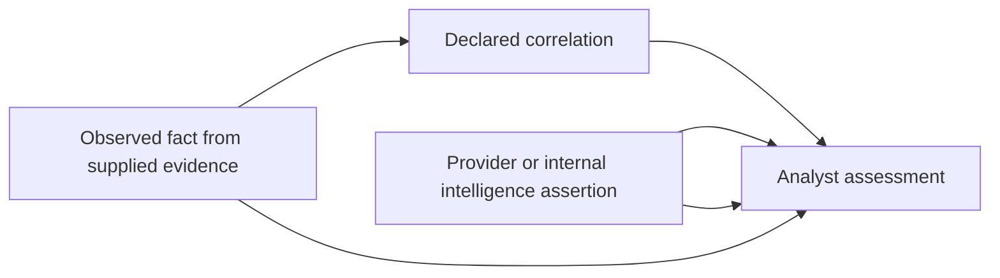

# Product Vision

## Vision

IOC Evidence Packager should become the fastest safe path from an investigation lead to a reviewable evidence story.

The product is a **local-first evidence compiler with an analyst workspace**. It accepts observables and already-authorized data, transforms heterogeneous records into source-linked facts, reveals both findings and blind spots, and exports the result without trapping the case inside the application.

## Product promise

> Give the application an IOC and the telemetry you are allowed to use. It will show where the IOC appeared, what entities connect those sightings, how complete the search was, what external sources say, what to examine next, and exactly which evidence supports every statement.

## Target users

### Primary: SOC triage analyst

Needs to investigate an alert quickly, avoid missing obvious pivots, document work consistently, and escalate a compact case to incident response.

### Secondary: incident responder or DFIR examiner

Needs to verify the first analyst's claims, trace each item to its source, understand gaps, and decide whether broader collection or forensic analysis is warranted.

### Secondary: small security team or MSSP

Needs a vendor-neutral workflow that works with approved exports, supports redacted handoffs, and does not require another server platform.

### Learning: student or instructor

Needs a visible explanation of IOC matching, provenance, coverage, correlations, false confidence, and reporting using safe synthetic evidence.

## Jobs to be done

When an analyst receives a suspicious IP, domain, URL, or hash, they want to:

1. determine whether it appears in the available evidence;
2. identify the affected hosts, users, processes, files, and destinations;
3. reconstruct a reliable time-ordered sequence;
4. separate direct observations from context, intelligence, and conclusions;
5. see missing or failed telemetry before interpreting absence as safety;
6. enrich the lead without accidentally disclosing private evidence;
7. know the most useful next investigative step;
8. hand the case to another person or platform without screenshots and copy/paste.

## The desired analyst moment

The most persuasive demonstration is not a decorative report. It is this workflow:

1. An analyst enters a suspicious SHA-256 hash and drops in endpoint, DNS, and proxy exports.
2. The application finds the file on two hosts, links one execution to an outbound connection, and shows the parent process and user.
3. The Coverage view warns that only one of three hosts has complete DNS telemetry and that a proxy file ended before the requested time range.
4. Optional hash intelligence identifies a known malware family, clearly labeled as a provider assertion rather than a local observation.
5. The Recommendations view proposes collecting a named artifact from the second host and searching a newly discovered domain; each suggestion cites the supporting event IDs and coverage gap.
6. The analyst exports a redacted Case Capsule. A responder opens it, verifies the hashes, and follows every conclusion back to the original record position.

That experience is the product's north star.

## Product pillars

| Pillar | Promise | Product consequence |
|---|---|---|
| Explainable by construction | Nothing important appears without a reason | Show rule, field, source, record, and evidence links |
| Coverage-aware | Absence has meaning only when search coverage is known | Make the coverage matrix a primary screen and export |
| Local and privacy-controlled | Organizational telemetry stays local by default | Offline mode is complete; network actions are explicit and logged |
| Portable and reproducible | The case can leave the workstation without losing its basis | Export a versioned Case Capsule with hashes and source inventory |
| Guided, not autonomous | The product helps analysts think without pretending to replace them | Recommend next steps; require the analyst to own assessments |
| Open to ecosystems | Existing security tools should become inputs or destinations | Use adapters and capability-based connectors, not vendor logic in core |

## Facts, intelligence, and conclusions

The workspace must visibly separate four layers:

- An **observed fact** says what a source record contains.
- A **correlation** says why two facts may be related under a declared rule.
- An **intelligence assertion** says what a provider claims about an observable.
- An **analyst assessment** records a human conclusion, confidence, rationale, and author/time.

No layer silently becomes another. A threat-feed hit does not rewrite a log sighting, and proximity does not become causation.

## Product principles

1. Preserve before transforming.
2. Explain before scoring.
3. Display limitations beside findings, not in fine print.
4. Prefer a focused vertical slice over many shallow integrations.
5. Treat network disclosure as a security decision.
6. Make partial success visible and recoverable.
7. Keep the domain and application core independent of Qt, SQL, and provider SDKs.
8. Use deterministic rules for evidence and recommendations.
9. Allow AI only as an optional prose assistant over selected, redacted material; never as the evidence authority.
10. Make the exported case useful without requiring the application.

## What success looks like

### Analyst outcomes

| Measure | Desired evidence after the first usable release |
|---|---|
| Time to a defensible handoff | Meaningfully lower than a manual copy/paste baseline |
| Planted direct matches missed | Zero in the reference cases |
| Evidence traceability | Every included fact maps to source hash and record position |
| Coverage transparency | Every requested telemetry category has an explicit state |
| Repeatability | Equivalent inputs and policy produce equivalent evidence content |
| Review efficiency | A second analyst can validate the story without access to the original consoles |
| Accidental disclosure | No network request occurs in offline mode; previews show all planned disclosures |

### Portfolio outcomes

- a polished desktop workflow rather than only a command demonstration;
- a safe synthetic case with multiple telemetry types and realistic gaps;
- visible engineering depth in adapters, job control, schemas, migrations, provenance, security, and testing;
- an example Case Capsule and a short before/after analyst demo;
- documented tradeoffs instead of a feature list with no product reasoning.

## Competitive position

The project should not compete with SIEMs on storage, Timesketch on large collaborative timelines, Velociraptor on collection, or MISP/OpenCTI on intelligence lifecycle management. It should integrate with them.

Its narrow position is:

> A desktop, coverage-aware compilation and handoff layer for IOC-centered investigations using data the analyst already has.

## Guardrails against product drift

A feature belongs in the core product when it improves one of these paths:

- lead to evidence;
- evidence to context;
- context to an explainable next action;
- investigation to a portable handoff.

Features whose primary job is continuous detection, enterprise retention, endpoint control, malware execution, broad intelligence curation, team chat, or case-management governance should be integrations rather than reimplemented subsystems.

## Open questions to validate with users

- Is the first daily workflow single-IOC triage or small IOC batches?
- Which three source formats remove the most real analyst friction?
- Which coverage categories are understandable without training?
- When does a relationship graph add value beyond a filtered evidence table?
- Which export profiles match SOC-to-IR, MSSP-to-client, and classroom handoffs?
- Are recommendation rules trusted when their evidence links and conditions are visible?

These questions affect feature priority, not the architectural invariants above.

