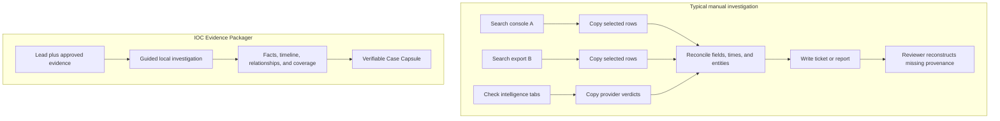
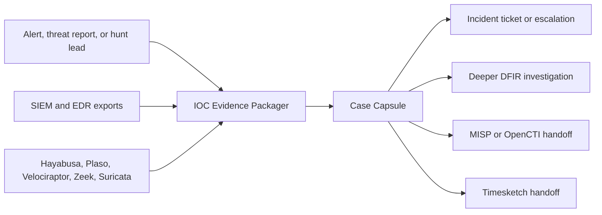

# Project Primer: What Is IOC Evidence Packager?

## The short version

IOC Evidence Packager answers a focused investigation question:

> Where did this IP address, domain, URL, or file hash appear in the evidence I have, what connects those sightings, what evidence is missing, and how can I hand the result to someone else without losing its source?

The analyst works in a local desktop GUI. They create a case, enter an observable, import approved log/tool exports, review facts and gaps, optionally consult approved intelligence, and export a verifiable Case Capsule.

## What is an IOC?

An **indicator of compromise (IOC)** is an observable value that may be associated with malicious activity.

| IOC type | Safe example | Where it might appear |
|---|---|---|
| IPv4 | `203.0.113.42` | Firewall, proxy, DNS, EDR logs |
| IPv6 | `2001:db8::10` | Network and endpoint telemetry |
| Domain | `example.test` | DNS, proxy, email, command lines |
| URL | `https://example.test/a` | Proxy, browser, email, sandbox results |
| SHA-256 | 64 hexadecimal characters | EDR, Sysmon, antivirus, file inventories |

An IOC is a **lead, not a verdict**. Shared infrastructure, scanners, sinkholes, reused files, benign testing, and stale intelligence can all create misleading hits.

## The analyst's problem

Imagine an alert contains the SHA-256 hash of a suspicious executable. The analyst needs to determine which computers observed it, where it was stored, whether it ran, which user and parent process were involved, whether it contacted another observable, when activity began, and which record supports each claim.

That information may be split across Wazuh alerts, Windows event triage output, DNS, proxy, Suricata, spreadsheets, and external reputation sites.



The manual path often loses the original field, record position, mapping, rejected records, query settings, and distinction between a log fact and a provider's opinion.

## What the application does

1. **Guides case creation.** The New Investigation wizard validates the lead, previews evidence, and makes privacy decisions visible.
2. **Preserves and normalizes.** Adapters map different schemas into canonical events while retaining original values and source references.
3. **Runs observable-specific recipes.** IP, domain, URL, and hash searches use compatible structured fields and safe pivots.
4. **Explains every inclusion.** Each result carries its source, record position, field path, rule, and plain-language reason.
5. **Separates evidence layers.** Direct sightings, context, provider assertions, and analyst assessments never blur together.
6. **Shows coverage.** Missing, partial, failed, unsupported, searched-no-match, and matched states are visible before conclusions.
7. **Suggests next actions.** Deterministic rules point to useful searches or collection requests and cite the reason.
8. **Packages the case.** Human and machine exports share one report model and integrity manifest.

## Worked example

An analyst receives:

```text
Lead: SHA-256 of a suspicious executable
Requested interval: 2026-08-06 09:00-10:00 UTC
Evidence: endpoint, DNS, and proxy exports
Policy: Offline
```

The workspace might show:

| Time UTC | Classification | Observation | Why included |
|---|---|---|---|
| 09:11:55 | Context | Parent process launched PowerShell on `WS-014` | Same host/process ancestry within the declared rule |
| 09:12:03 | Direct sighting | File with the queried hash appeared on `WS-014` | Exact canonical SHA-256 match in a declared hash field |
| 09:12:07 | Pivot result | PowerShell connected to `203.0.113.42` | Network event linked by process and host |
| 09:12:08 | Pivot result | DNS answer connected `bad.example` to the IP | Typed DNS relationship supported by the source record |

The Coverage view might simultaneously say:

- endpoint process telemetry: match found for `WS-014` and `WS-022`;
- DNS: partial coverage because `WS-022` records end at 09:30;
- proxy: source not provided for `WS-022`;
- intelligence: not queried because the case is Offline.

The application can suggest requesting the missing proxy interval or searching the discovered IP. It cannot declare the users malicious or the hosts compromised.

## Why the Coverage Matrix matters

These two statements are not equivalent:

- "The supplied DNS records were searched across the full requested interval and the domain did not appear."
- "No DNS evidence was supplied."

Many reports collapse both to "not found." IOC Evidence Packager preserves the difference so an analyst and reviewer know what absence can and cannot mean.

## Where it fits



The project sits between **data search** and **case communication**. Mature systems continue to collect, detect, enrich, collaborate, and respond; the packager compiles a focused, portable evidence story from authorized inputs.

## Who benefits

- A junior analyst gets a guided workflow, visible blind spots, and explanations.
- A responder receives a compact starting case instead of screenshots and incomplete notes.
- A small team gets a vendor-neutral local tool without another server.
- An MSSP or consultant can produce a consistent redacted handoff.
- A student can see why matching, provenance, coverage, and inference are different concepts.

## What makes the result trustworthy?

- **Provenance:** source digest, adapter, record position, field, and rule for each fact.
- **Integrity:** hashes detect later byte changes to sources and exported artifacts.
- **Preservation:** normalization never silently replaces the original value.
- **Explainability:** direct sightings, pivots, context, and recommendations cite their basis.
- **Coverage:** missing and failed evidence is reported beside successful findings.
- **Determinism:** equivalent inputs and versions produce equivalent normalized content.
- **Privacy:** offline is complete; network disclosure is explicit and recorded.
- **Limitations:** rejected records, ambiguous time, unsupported fields, and partial intervals stay visible.

These controls improve reviewability. They do not alone prove acquisition quality, complete chain of custody, or legal admissibility.

## What it is not

- Not a malware detector, reputation oracle, or universal risk score.
- Not a live endpoint collector or SOAR remediation engine.
- Not a SIEM, EDR, forensic suite, or long-term intelligence platform.
- Not an AI investigator that decides which evidence matters.
- Not a guarantee that an IOC hit proves compromise.
- Not a guarantee that a no-match result proves safety.

## The first useful implementation

1. Launch a PySide6 desktop shell and create a durable local case.
2. Validate one IPv4, domain, or SHA-256 lead.
3. Preview and import a safe canonical JSONL source in a cancellable background job.
4. Find structured direct matches and preserve provenance.
5. Display the Evidence ledger and Coverage Matrix.
6. Export deterministic HTML, JSONL, inventory, coverage, and manifest artifacts.
7. Prove the flow with a golden synthetic incident and security tests.

## Next reading

- [Product Vision](PRODUCT_VISION.md)
- [Problem Study](PROBLEM_STUDY.md)
- [Core and Smart Features](FEATURES.md)
- [GUI and Interaction Design](GUI_UX.md)
- [Scope](SCOPE.md)
- [Architecture](ARCHITECTURE.md)
- [Implementation Blueprint](IMPLEMENTATION_BLUEPRINT.md)
