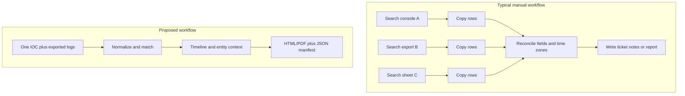
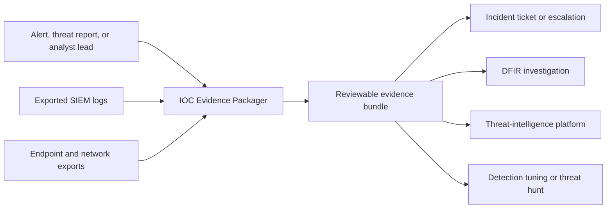

# Project Primer: What Is IOC Evidence Packager?

## The short version

IOC Evidence Packager answers one focused investigation question:

> Where did this IP address, domain, or file hash appear in the logs I have, and how can I package those findings so someone else can verify them?

The input is one IOC plus exported logs. The output is an analyst-friendly report, normalized event data, and a manifest describing the inputs and how the result was produced.

## What is an IOC?

An **indicator of compromise (IOC)** is an observable value that may be connected to malicious activity.

| IOC type | Example | Where it might appear |
|---|---|---|
| IPv4 | `203.0.113.42` | Firewall, proxy, DNS, EDR logs |
| IPv6 | `2001:db8::10` | Network and endpoint telemetry |
| Domain | `example.test` | DNS, proxy, email, command lines |
| URL | `https://example.test/a` | Proxy, browser, email, sandbox results |
| File hash | `sha256:...` | EDR, Sysmon, antivirus, file inventories |

An IOC is a **lead**, not a verdict. A scanner, shared service, sinkhole, or reused hosting address can create benign occurrences. Context lets an analyst judge relevance.

## The analyst's problem

Imagine an alert contains the SHA-256 hash of a suspicious executable. The analyst needs to determine which computers observed it, where it was stored, which user and process were involved, when activity began, whether it contacted another IOC, and which log supports each claim.

Evidence may be split across Wazuh alerts, Sysmon exports, DNS logs, proxy records, and spreadsheets. Even if each source is searchable, the analyst must copy, clean, order, label, and explain the results.



## What the tool would do

1. **Accept existing evidence.** It consumes exported data rather than connecting to live endpoints in v1.
2. **Normalize without erasing.** It maps fields such as `host`, `hostname`, and `agent.name` into a canonical event while retaining the raw record.
3. **Validate the IOC.** It detects type, rejects malformed input, and creates a canonical comparison value.
4. **Find defensible matches.** Each result records the field, rule, and value that caused its inclusion.
5. **Separate observation from context.** Direct IOC matches are distinct from nearby events correlated by host, process, or time window.
6. **Package the story.** It produces a timeline, entity summaries, source inventory, normalized data, and an integrity manifest.

## Worked example

An analyst receives this lead:

```text
IOC: 203.0.113.42
Type: IPv4
Reason: observed in a threat report
```

They export DNS events, proxy connections, and Wazuh endpoint events. The packager might produce:

| Time (UTC) | Source | Host | Observation | Why included |
|---|---|---|---|---|
| 09:12:03 | DNS | `WS-014` | `bad.example` resolved to the IOC | Direct IP match |
| 09:12:07 | Proxy | `WS-014` | User `alice` connected to the IOC | Direct destination-IP match |
| 09:12:08 | Endpoint | `WS-014` | `powershell.exe` opened the connection | Direct IP match plus process context |
| 09:11:55 | Endpoint | `WS-014` | Parent launched PowerShell | Context event within configured window |

The report would not say that Alice is malicious or the host is definitely compromised. It would state what was observed, how it matched, and which questions remain.

## Where it fits



The project sits between **data search** and **case communication**. It can receive exports from a SIEM, EDR, or collection tool and hand results to a ticket, case system, forensic notebook, or threat-intelligence platform.

## Who benefits

- A **junior SOC analyst** gets a guided workflow and an output that explains every match.
- An **incident responder** receives a compact starting bundle instead of reconstructing another analyst's screenshots.
- A **small organization** can use approved exports and SQLite without operating a large platform.
- A **student or instructor** can demonstrate IOC pivoting, provenance, false positives, and reporting using synthetic data.

## What makes a package trustworthy?

- **Provenance:** identify the source file and source record for every event.
- **Integrity:** hash inputs and outputs so later changes can be detected.
- **Preservation:** retain raw values and never silently rewrite the source.
- **Explainability:** label direct matches and contextual correlations separately.
- **Determinism:** equivalent inputs and settings produce equivalent normalized evidence.
- **Limitations:** disclose rejected records, missing time zones, unsupported fields, and incomplete coverage.

These controls improve reviewability but do not by themselves establish legal chain of custody or forensic soundness. Those depend on acquisition procedures, organizational controls, and jurisdiction.

## What it is not

- Not a malware detector or reputation oracle.
- Not a live endpoint collector.
- Not a SIEM or long-term log platform.
- Not a full threat-intelligence platform.
- Not an automated incident-response decision maker.
- Not a replacement for human analysis.
- Not a guarantee of legal admissibility.

## The simplest useful v1

1. Load synthetic JSONL events.
2. Search one IPv4, domain, or SHA-256 hash.
3. Preserve raw records and source positions.
4. Build a UTC timeline and entity summaries.
5. Render deterministic HTML and JSON outputs.
6. Demonstrate the result with tests and a safe sample case.

This vertical slice proves the idea before native EVTX support, enrichment APIs, PDF rendering, or a graphical interface.

## Next reading

- [Problem Study](PROBLEM_STUDY.md)
- [Scope](SCOPE.md)
- [Architecture](ARCHITECTURE.md)
- [Roadmap](ROADMAP.md)
- [Glossary](GLOSSARY.md)
