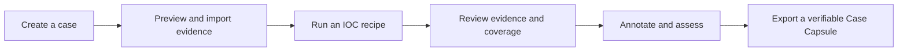

# Scope and First-Release Product Contract

## Goal

Build a local-first desktop application that investigates validated observables across approved evidence exports and produces a coverage-aware, source-linked case that another analyst can review or export without access to the original consoles.

The GUI is the primary interface. A thin CLI may automate the same use cases through the same application services; it is not a separate product or implementation.

## Primary release outcome

The first usable release should let an analyst complete this loop:

## Primary users

- SOC analysts triaging and escalating suspicious observables.
- Incident responders reviewing an initial evidence handoff.
- Small security teams working from approved exports.
- DFIR students and instructors using synthetic cases.

## Supported observable types

| Type | First-release behavior |
|---|---|
| IPv4 | Parse and compare canonical address form |
| IPv6 | Parse and compare canonical compressed form |
| Domain | Lowercase, trim the root dot, validate labels, preserve original, identify registrable domain |
| SHA-256 | Validate 64 hexadecimal characters and lowercase |

URL is the next observable type after the vertical slice. MD5 and SHA-1 may later be accepted as identifiers but never presented as strong integrity hashes. CIDR, email addresses, registry keys, fuzzy hashes, certificates, and vulnerability IDs are later candidates.

## Inputs

### Initial vertical slice

- a documented canonical JSONL schema;
- a safe synthetic incident containing endpoint, DNS, and proxy-style canonical records;
- one lead observable and a requested time range.

### First usable release

- generic JSONL and JSON arrays;
- generic CSV with an explicit, saved field mapping;
- selected Wazuh JSON exports;
- Hayabusa JSONL produced from Sysmon/Windows event logs;
- Suricata `eve.json` if the vertical slice remains stable.

Generic Parquet, Zeek, Plaso, Velociraptor, Elastic Common Schema, direct read-only search connectors, and other adapters follow after the adapter contract is proven.

Native EVTX parsing, packet capture decoding, disk-image examination, and live endpoint collection are not first-release responsibilities. The application should accept established tool output rather than reimplement mature parsers prematurely.

## Required desktop capabilities

### Case management

- create, open, rename, archive, and safely recover a local case;
- record lead, observables, requested interval, notes, privacy policy, and run history;
- store cases in a user-selected workspace with clear data-retention behavior.

### New Investigation wizard

- validate the lead observable;
- choose files/folders and preview adapter detection;
- preview mappings, time-zone assumptions, compatible recipes, and warnings;
- select the privacy/enrichment policy and review the disclosure plan;
- review all settings before starting;
- start a cancellable background job and open the case workspace.

### Evidence review

- display normalized evidence with direct/context/pivot classifications;
- filter by time, source, entity, match rule, and review state;
- open the preserved raw record and provenance details;
- bookmark, annotate, and include/exclude from an export without mutating the source fact.

### Coverage

- calculate and display all six defined coverage states;
- identify source, host, time-range, parser, or schema limitations;
- link a coverage cell to the relevant source inventory and warnings;
- include the matrix and limitations in exports.

### Timeline and summary

- order events deterministically;
- show first/last seen and affected-entity summaries;
- separate direct evidence from context visually;
- keep invalid/unknown timestamps visible in an undated group.

### Export

- generate deterministic `evidence.jsonl`, `coverage.json`, `source-inventory.json`, and `manifest.json`;
- generate a self-contained, auto-escaped HTML report from the shared report model;
- write only to a validated destination and never overwrite source evidence;
- verify finalized artifact hashes.

PDF, graph JSON, CSV timeline, ZIP packaging, redaction profiles, and platform handoffs are added in later phases without changing the core evidence semantics.

## Canonical evidence requirements

A normalized event contains:

- case-local stable event ID derived from source identity and source position;
- source ID, source SHA-256, adapter/version, and record/line reference;
- original timestamp text, normalized UTC timestamp when possible, and assumptions;
- supported host, user, process, parent process, file, hash, IP, domain, URL, and action fields;
- original values plus normalized observable values and field paths;
- raw record or lossless source reference;
- parser and normalization warnings.

Missing optional fields are allowed. Missing time zones or invalid timestamps must be disclosed and never silently invented.

## Matching contract

The first release must:

1. detect or accept the observable type and reject malformed input clearly;
2. apply a versioned search recipe appropriate to that type;
3. compare canonical values only in fields declared compatible by the adapter;
4. record original field path/value, normalized value, rule ID, and explanation;
5. deduplicate one source event without collapsing distinct events;
6. distinguish direct matches, pivots, context events, and raw-text fallback;
7. keep context rules bounded and user-visible;
8. calculate coverage even when no matches are found.

Raw substring scanning is not equivalent to a structured match. If supported as a fallback, it has its own lower-assurance classification and coverage semantics.

## Required case views

| View | First-release content |
|---|---|
| Dashboard | case summary, finding counts, affected entities, warnings, next steps |
| Evidence | filterable ledger, provenance, explanations, raw record |
| Timeline | deterministic event sequence and undated lane |
| Coverage | matrix, gaps, failures, and recovery links |
| Sources | inventory, hashes, adapters, counts, warnings |
| Exports | profile, destination, artifact list, verification result |
| Settings | case time zone, privacy policy, safe display preferences |

Relationships, Intelligence, and Recommendations may initially appear as disabled or preview tabs. They become release requirements only in the roadmap phases that implement them.

## Non-functional requirements

- Offline operation is complete and the default.
- No telemetry, analytics, remote fonts, update checks, DNS resolution, or automatic uploads in offline mode.
- Windows is the first supported desktop; Linux support follows without domain-layer changes.
- Imports and network calls run outside the GUI thread and are cancellable.
- Case writes are transactional; interruptions cannot create a falsely complete run.
- Bounded memory use through streaming, batching, and pagination.
- SQLite queries are parameterized and migrations are tested.
- Output paths cannot escape the selected destination.
- HTML auto-escaping stays enabled; PDF conversion cannot fetch remote resources.
- Equivalent evidence, policy, recipe, and versions produce equivalent normalized evidence content.
- User-facing errors avoid printing raw sensitive records by default.
- Synthetic fixtures use reserved examples and no victim or customer data.
- The interface remains usable with keyboard navigation and standard scaling.

## First-release acceptance criteria

The release is credible when:

- IPv4, IPv6, domain, and SHA-256 validators pass positive, negative, and lookalike tests.
- The GUI can create, close, reopen, and recover a case.
- The wizard previews formats, mappings, time assumptions, and the offline policy before a run.
- A cancellable background import leaves a correct cancelled run state.
- A synthetic multi-source case includes true matches, benign lookalikes, duplicates, malformed records, missing telemetry, partial time coverage, and mixed time zones.
- All planted structured matches are found and lookalikes excluded.
- Every evidence item opens provenance identifying the source hash and record position.
- All six coverage states are exercised by golden tests.
- Rejected records and unsupported sources appear in the UI and exported limitations.
- Re-running with equivalent inputs and versions produces equivalent `evidence.jsonl` content.
- Malicious-looking strings render as text in the GUI and HTML output.
- Input/output hashes verify from the finalized manifest.
- An end-to-end test completes without network access.
- The repository includes screenshots and an example Case Capsule from synthetic data.

## Explicit non-goals

- Continuous ingestion, retention, alerting, or detection engineering.
- Live acquisition or remote endpoint commands in the core.
- Automated containment, blocking, deletion, or remediation.
- Malware execution, detonation, sample distribution, or automatic file upload.
- A universal reputation or incident-severity score.
- Autonomous analyst conclusions or AI-controlled evidence selection.
- Enterprise identity, multi-tenancy, real-time collaboration, or full case governance.
- Legal chain-of-custody or court-admissibility claims.
- Replacing MISP, OpenCTI, TheHive, Timesketch, Velociraptor, Wazuh, or a SIEM.
- Sending any value to an external provider without policy approval and disclosure preview.

## Later candidates

- URL and small multi-observable cases;
- relationship graph and rule-based recommendations;
- CIRCL hashlookup, ThreatFox, URLhaus, MalwareBazaar, GreyNoise, RDAP, and internal intelligence;
- DuckDB acceleration for large CSV/JSON/Parquet sources;
- redaction profiles, PDF, ZIP, signatures, and verification utility;
- STIX/MISP/OpenCTI/TheHive/Timesketch handoffs;
- read-only Wazuh/OpenSearch and Velociraptor imports;
- optional local-model narrative drafting with evidence citations;
- signed manifests and tamper-evident case activity logs.

## Decision rule for additions

A proposed feature belongs in this repository when it improves the path from an investigation lead plus authorized evidence to a more explainable, coverage-aware, reproducible handoff. If its main purpose is collection, continuous detection, broad intelligence management, endpoint control, or enterprise collaboration, integration with a specialist tool is preferred.
